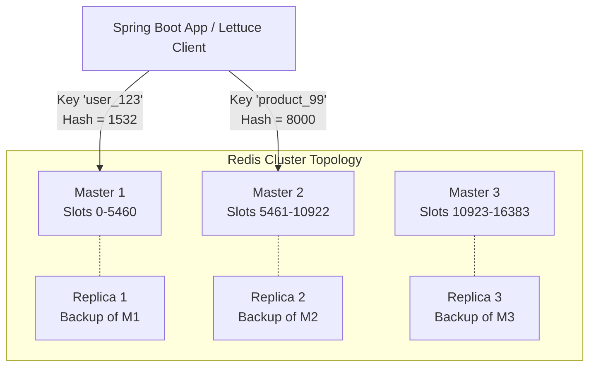

# 🚀 Redis Cluster & High Availability

> **Category**: NoSQL & Caching | **Complexity**: Advanced | **Redis**: 7.x

---

## 📖 Core Technical Mechanics & Deep-Dive

### Vai trò của Redis trong System Design
Redis là kho lưu trữ In-Memory Data Structure Store cực nhanh, thường được dùng để:
1. **L1/L2 Caching**: Giảm tải cho Database chính (PostgreSQL).
2. **Rate Limiting**: Dùng chung với Bucket4j.
3. **Session Store**: Quản lý JWT Blacklist, giỏ hàng (Cart).
4. **Distributed Lock**: Redisson, tránh Race Conditions giữa các Pods.
5. **Pub/Sub**: Trạm trung chuyển event nội bộ (ví dụ: WebSocket Broadcast).

### 3 Chế độ triển khai Redis
1. **Standalone**: 1 Node duy nhất. Chết là mất trắng dữ liệu. Không bao giờ dùng cho Production.
2. **Redis Sentinel (Master-Replica HA)**: Có 1 Master Node cho Ghi (Write), nhiều Replica Node cho Đọc (Read). Các node "Sentinel" giám sát Master. Nếu Master chết, Sentinel tự động bầu Replica lên làm Master. Dữ liệu vẫn chứa trọn vẹn trong 1 Node (Không Sharding).
3. **Redis Cluster (Sharding + HA)**: Dữ liệu được băm (hash) qua 16384 slot và chia đều ra nhiều Master Nodes. Mỗi Master lại có các Replica của riêng nó. 
   - Dùng khi bộ nhớ vượt quá RAM của 1 server (ví dụ: Cần 200GB Cache).
   - Redis Cluster có khả năng Scale out vô hạn (theo lý thuyết) bằng cách thêm Node.

---

## 🌐 Real-World GitHub Patterns & Industry Reference

- **[redis/redis](https://github.com/redis/redis)** — Source code chính thức.
- **[bitnami/charts/tree/main/bitnami/redis-cluster](https://github.com/bitnami/charts/tree/main/bitnami/redis-cluster)** — Cấu hình chuẩn K8s Helm chart cho Redis Cluster.

---

## 📐 System Design Blueprint

### Kiến trúc Redis Cluster (3 Masters, 3 Replicas)


*Ghi chú: Client (như Lettuce trong Spring Boot) tự động kết nối với toàn bộ các Master. Khi có 1 key cần GHI, client tính `CRC16(key) % 16384` để biết chính xác phải GHI vào Master nào.*

---

## ⚙️ Production Configuration

### 1. Redis Configuration (redis.conf)

```ini
# --- Bật Cluster Mode ---
cluster-enabled yes
cluster-config-file nodes.conf
cluster-node-timeout 5000 # Cực kỳ quan trọng: Nếu Master không hồi đáp trong 5s, bắt đầu Failover

# --- Bộ nhớ & Eviction (Chống tràn RAM) ---
maxmemory 4gb

# Cực kỳ quan trọng với Cache: Nếu đầy RAM, Redis sẽ làm gì?
# - allkeys-lru: Xóa các key ít được sử dụng nhất (Khuyên dùng cho Caching).
# - volatile-lru: Chỉ xóa các key có TTL.
# - noeviction: Báo lỗi OOM không cho Ghi nữa (Chỉ dùng nếu Redis là DB chính).
maxmemory-policy allkeys-lru 

# --- Persistence (Bảo vệ dữ liệu khi mất điện) ---
# 1. RDB (Snapshot): Lưu file dump.rdb mỗi X giây. Nhanh nhưng có nguy cơ mất data giữa các mốc.
save 900 1
save 300 10
save 60 10000

# 2. AOF (Append Only File): Lưu mọi lệnh write vào file. An toàn nhưng IO chậm hơn.
appendonly yes
appendfsync everysec
```

### 2. Spring Boot Integration (`application.yml`)

```yaml
spring:
  data:
    redis:
      # Định nghĩa cụm Redis Cluster
      cluster:
        nodes:
          - redis-node-1:6379
          - redis-node-2:6379
          - redis-node-3:6379
        # Tự động refresh topo mạng (VD: Khi Cluster có Node mới hoặc Failover đổi IP)
        max-redirects: 3
      
      lettuce:
        cluster:
          refresh:
            adaptive: true         # Tự động update IP của Cluster nếu Master chết
            period: 60s
        pool:
          max-active: 50           # Số lượng kết nối duy trì tới Cluster
          max-idle: 10
```

---

## 🧪 Verification Commands

```powershell
# Truy cập vào CLI của một Node trong Cluster (Cần cờ -c để báo nó biết đây là Cluster)
redis-cli -h 127.0.0.1 -p 6379 -c

# Xem trạng thái Cluster
127.0.0.1:6379> CLUSTER INFO
127.0.0.1:6379> CLUSTER NODES

# Test Ghi dữ liệu, nó sẽ báo "Redirected to slot [xxx]" nếu slot không thuộc Node hiện tại
127.0.0.1:6379> SET user_123 "John Doe"
```

---

## ⚡ Best Practices & Anti-Patterns

### ✅ Best Practices
1. **Dùng Hash Tags `{}` cho các Transaction/Lua Scripts**: Redis Cluster CẤM chạy Lua Script hoặc lệnh `MSET` (Multi-Set) trên các Key nằm ở 2 Slot (2 Node) khác nhau. Để ép 2 Key vào cùng 1 Slot, bọc tiền tố bằng dấu `{}`. Ví dụ: `SET {user:123}:profile "A"`, `SET {user:123}:stats "B"`. Cả 2 key này sẽ chung 1 Slot vì Redis chỉ hash phần chữ nằm trong ngoặc nhọn `{user:123}`!
2. **Bật `cluster-require-full-coverage no`**: Mặc định, nếu 1 Slot (1 vùng data) bị chết hẳn (Master chết mà Replica cũng chưa kip lên), Redis Cluster sẽ khoá 100% Write trên TOÀN BỘ hệ thống (Dù 99% data kia vẫn sống). Set cờ này về `no` để cô lập lỗi ở phần tử hỏng.
3. **Lettuce Client**: Trong Java, luôn dùng Lettuce (mặc định của Spring Boot 3) thay vì Jedis. Lettuce hỗ trợ non-blocking, reactive, và Redis Cluster tự động refresh topo mạng.

### ❌ Anti-Patterns

| Anti-Pattern | Problem | Fix |
|-------------|---------|-----|
| Dùng lệnh `KEYS *` để tìm kiếm | Quét qua toàn bộ Cluster, chặn (block) toàn bộ các lệnh I/O khác trên Single-Thread của Redis. Làm chết Server. | Dùng lệnh `SCAN 0 MATCH "user:*" COUNT 100` để quét phân trang mà không khóa DB. |
| Coi Redis là CSDL chính (Source of Truth) cho dữ liệu tài chính | Redis lưu RAM và ghi đĩa không đồng bộ (bất đồng bộ). Chập điện sẽ mất giao dịch vài mili-giây cuối. | Redis chỉ dùng làm Cache, Rate Limit, Session. Data cốt lõi phải nằm ở PostgreSQL (ACID). |
| Lưu nguyên 1 object JSON 10MB vào 1 String Key | Đẩy qua mạng chậm, tốn RAM, Serialization/Deserialization làm nghẽn CPU ở Backend. | Tách nhỏ dữ liệu, hoặc dùng Redis Hash (`HSET`) để chỉ cập nhật 1 trường cụ thể. |
