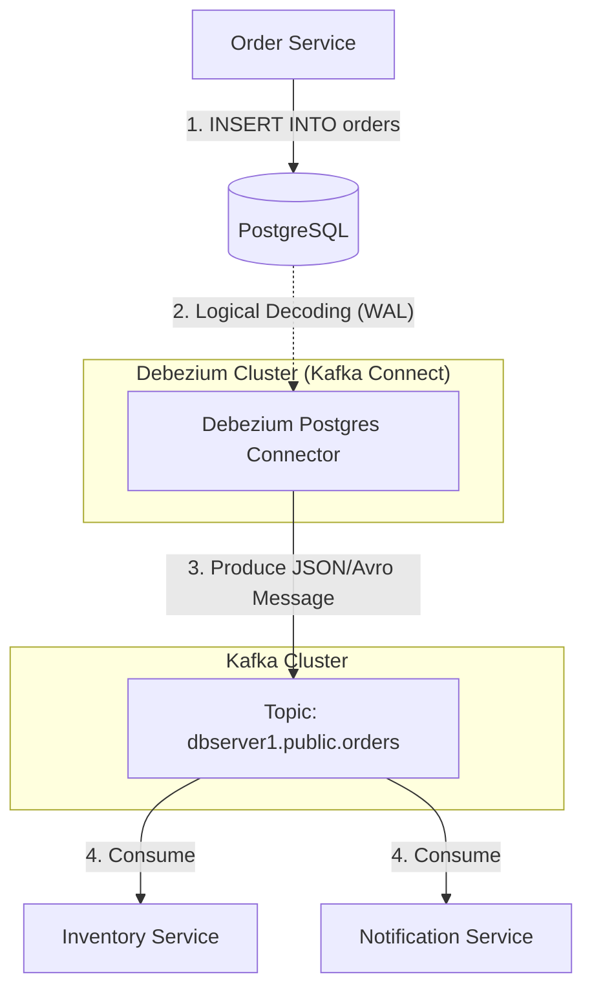

# 🌊 Change Data Capture (CDC) with Debezium

> **Category**: Data Streaming | **Complexity**: Expert | **PostgreSQL**: 16+ | **Debezium**: 2.x

---

## 📖 Core Technical Mechanics & Deep-Dive

### Bài toán Microservices Data Synchronization
Trong kiến trúc Microservices, mỗi Service có một Database riêng (Database per Service). 
Khi Order Service cập nhật trạng thái đơn hàng thành `PAID`, làm sao để Inventory Service biết để trừ kho, và Notification Service biết để gửi Email?

**Cách truyền thống (Kém an toàn)**: 
Order Service tự gọi API (HTTP) hoặc tự gửi Kafka Message sau khi Ghi DB.
- Lỗi: DB lưu thành công, nhưng gửi Kafka thất bại (do rớt mạng) -> Dữ liệu vĩnh viễn không đồng bộ! (Dual-write problem).

### Giải pháp CDC (Change Data Capture)
Sử dụng một công cụ đứng ngoài Ứng dụng, "nghe lén" Database.
- Thay vì Application gửi Kafka, **Database tự gửi Kafka!**
- PostgreSQL có cơ chế **Logical Replication** (dựa trên WAL). Mọi thao tác `INSERT`, `UPDATE`, `DELETE` đều được ghi ra WAL.
- **Debezium** là một connector (chạy trên Kafka Connect) đóng vai trò làm Logical Replica của Postgres. Nó đọc WAL log, biến mỗi dòng dữ liệu bị đổi thành một Kafka Message, và bắn lên Topic.
- Độ trễ cực thấp (vài mili-giây). Đảm bảo không bao giờ sót sự kiện (Exactly-once hoặc At-least-once).

---

## 🌐 Real-World GitHub Patterns & Industry Reference

- **[debezium/debezium](https://github.com/debezium/debezium)** — Nền tảng CDC mã nguồn mở chuẩn công nghiệp.
- **[confluentinc/cp-kafka-connect](https://github.com/confluentinc/kafka-connect-docker)** — Kafka Connect runtime để chạy Debezium.

---

## 📐 System Design Blueprint

### Kiến trúc Debezium CDC



---

## ⚙️ Production Configuration

### 1. postgresql.conf (Bật Logical Replication)

Debezium KHÔNG thể hoạt động nếu bạn không thiết lập các thông số này trên DB:

```ini
# Bắt buộc chuyển wal_level thành logical (Mặc định là replica)
wal_level = logical

# Số lượng Replication Slots tối đa. Debezium cần 1 slot.
max_replication_slots = 5

# Số lượng tiến trình được phép đọc WAL
max_wal_senders = 10
```
*Lưu ý: Bạn phải tạo 1 user riêng cho Debezium, cấp quyền `REPLICATION` và `LOGIN`.*

### 2. Cấu hình Debezium Connector (JSON Payload)
Bạn gửi file JSON này (qua API POST) tới Kafka Connect để kích hoạt Debezium theo dõi bảng `orders`.

```json
{
  "name": "inventory-connector",
  "config": {
    "connector.class": "io.debezium.connector.postgresql.PostgresConnector",
    "tasks.max": "1",
    
    "database.hostname": "postgres",
    "database.port": "5432",
    "database.user": "debezium_user",
    "database.password": "secret",
    "database.dbname": "shop_db",
    "database.server.name": "dbserver1",
    
    "plugin.name": "pgoutput", // Sử dụng plugin mặc định của Postgres 10+
    
    // RẤT QUAN TRỌNG: Chỉ theo dõi những bảng cần thiết. 
    // Không bắt Debezium đọc cả DB, sinh ra hàng triệu message rác!
    "table.include.list": "public.orders, public.payments",
    
    // Định dạng Output ra Kafka
    "key.converter": "org.apache.kafka.connect.json.JsonConverter",
    "value.converter": "org.apache.kafka.connect.json.JsonConverter",
    "key.converter.schemas.enable": "false",
    "value.converter.schemas.enable": "false"
  }
}
```

### 3. Cấu trúc Message của Debezium trên Kafka
Khi 1 dòng trong bảng `orders` bị `UPDATE`, Debezium sinh ra 1 message JSON chứa cả dữ liệu `before` (trước khi sửa) và `after` (sau khi sửa):

```json
{
  "op": "u", // Operation: 'c' (create), 'u' (update), 'd' (delete)
  "source": {
    "ts_ms": 1697334567123,
    "table": "orders"
  },
  "before": {
    "id": 100,
    "status": "PENDING"
  },
  "after": {
    "id": 100,
    "status": "PAID"
  }
}
```

---

## 🧪 Verification Commands

```bash
# 1. Khởi chạy Debezium Connector qua REST API
curl -X POST -H "Content-Type: application/json" \
     -d @connector.json \
     http://localhost:8083/connectors

# 2. Kiểm tra status của Connector
curl http://localhost:8083/connectors/inventory-connector/status

# 3. Mở Kafka Console Consumer để hứng dữ liệu CDC realtime
kafka-console-consumer --bootstrap-server localhost:9092 \
                       --topic dbserver1.public.orders \
                       --from-beginning
```

---

## ⚡ Best Practices & Anti-Patterns

### ✅ Best Practices
1. **Dùng Avro thay vì JSON**: JSON làm message của Debezium phình to gấp 10 lần thực tế vì chứa quá nhiều schema metadata. Trên Production, BẮT BUỘC dùng Avro hoặc Protobuf (kết hợp với Confluent Schema Registry).
2. **Xử lý Message rác (Tombstone)**: Khi một row bị DELETE, Debezium gửi đi 1 message có value = `null`. Consumer (Spring Kafka) phải check cẩn thận để không bị `NullPointerException`.
3. **Chỉ include những bảng cần thiết**: Luôn set `table.include.list`. Việc capture toàn bộ DB sẽ tạo ra hàng chục topic rác và làm nghẽn Kafka.

### ❌ Anti-Patterns

| Anti-Pattern | Problem | Fix |
|-------------|---------|-----|
| Mở Logical Replication Slot nhưng Debezium Connector bị chết | Postgres không thấy Debezium đọc WAL, nên nó cứ giữ WAL lại mãi (Sợ Debezium bị sót data). Sau vài ngày, ổ cứng DB bị đầy 100% -> Sập Server! | Set `max_slot_wal_keep_size` trong postgresql.conf (VD: 5GB). Nếu Debezium chết quá lâu, Postgres sẽ tự hy sinh Debezium (xóa WAL) để cứu DB. (Debezium sẽ phải Snapshot lại từ đầu khi sống lại). |
| App Consumer không xử lý Idempotent | CDC đảm bảo At-least-once. Tức là 1 event UPDATE có thể bị bắn tới Consumer 2 lần. Nếu không có Idempotent, bạn sẽ trừ tiền khách 2 lần! | Consumer luôn phải lưu lại `event_id` hoặc kiểm tra State DB trước khi xử lý (Idempotency). |
| Bắn thẳng Event CDC ra cho tất cả Services đọc | Schema của DB thay đổi (`ALTER TABLE`), các event CDC đổi cấu trúc -> Hàng loạt Microservices khác chết theo (Leaking Internal Schema). | Dùng Outbox Pattern (Bài tiếp theo). |
