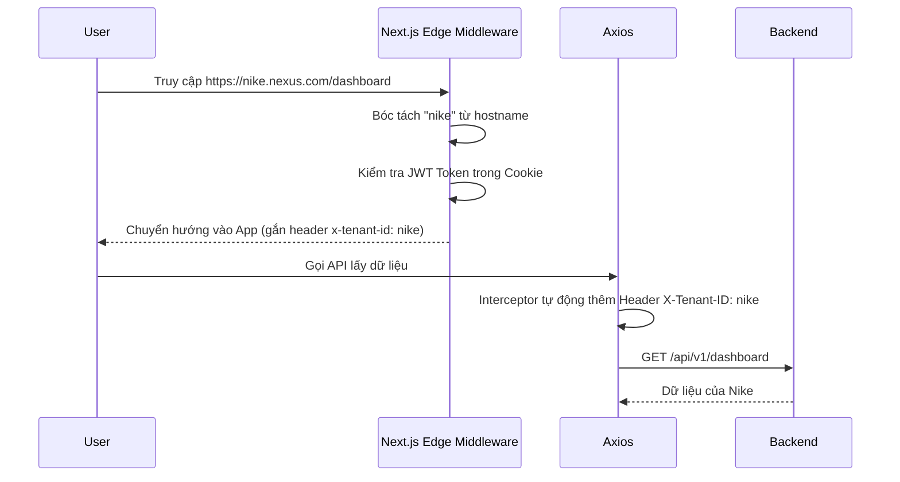

# BẢN ĐẶC TẢ HỆ THỐNG & KIẾN TRÚC FRONTEND TỔNG THỂ (MEGA SRS)
**Dự án:** Nexus POS & ERP (Enterprise B2B Multi-Tenant Platform)
**Phiên bản:** 3.0.0
**Mức độ:** Chi tiết (Component, State, Interface, Payload API, Kịch bản Kiểm thử).

---

## 1. KIẾN TRÚC TỔNG THỂ & CORE VẬN HÀNH

### 1.1. Kiến trúc Next.js App Router (FSD - Feature Sliced Design)
Hệ thống tuân thủ thiết kế Domain-Driven, chia nhỏ các Feature độc lập.

```text
src/
├── app/
│   ├── (public)/                 
│   │   ├── login/page.tsx        
│   │   └── mfa-verify/page.tsx   
│   ├── [tenantId]/               
│   │   ├── (pos)/pos/page.tsx    
│   │   ├── (erp)/
│   │   │   ├── dashboard/page.tsx
│   │   │   ├── products/page.tsx
│   │   │   └── orders/page.tsx
│   ├── layout.tsx                
│   └── error.tsx                 
├── shared/                       
│   ├── api/                      
│   ├── config/                   
│   ├── lib/                      
│   └── ui/                       
├── features/                     
│   ├── auth/                     
│   ├── pos/                      
│   ├── catalog/                  
│   └── realtime/                 
```

### 1.2. Chiến lược Quản lý State Đa Tầng

#### A. Server State (TanStack React Query v5)
- **Quy tắc Query Key:** `[tenantId, moduleName, resource, action, filters]`.
  - *Ví dụ:* `['nike', 'catalog', 'products', 'list', { page: 1, sort: 'desc' }]`.
- **Chiến lược Caching (StaleTime):**
  - Danh mục, Cấu hình: `staleTime: 1000 * 60 * 30` (30 phút).
  - Danh sách đơn hàng: `staleTime: 1000 * 30` (30 giây).
  - Tồn kho, Giỏ hàng: `staleTime: 0` (Luôn luôn gọi lại).

#### B. Global Client State (Zustand)
```typescript
interface CartItem {
  id: string;
  sku: string;
  name: string;
  price: number;
  quantity: number;
  discount?: number;
}

interface CartStore {
  items: CartItem[];
  tenantId: string | null;
  addItem: (item: Product) => void;
  updateQuantity: (productId: string, qty: number) => void;
  removeItem: (productId: string) => void;
  clearCart: () => void;
  checkoutStatus: 'IDLE' | 'PROCESSING' | 'SUCCESS' | 'FAILED';
  setCheckoutStatus: (status: string) => void;
}
```

#### C. Local Form State (React Hook Form + Zod)
```typescript
const ProductSchema = z.object({
  name: z.string().min(5, "Tên quá ngắn"),
  price: z.number().positive("Giá phải lớn hơn 0"),
  sku: z.string().min(3, "SKU không hợp lệ"),
  categoryId: z.string().uuid("Danh mục không hợp lệ"),
  version: z.number(), // Bắt buộc cho Optimistic Locking
});
```

---

## 2. ĐẶC TẢ CHI TIẾT MODULE IAM & MULTI-TENANCY

### 2.1. Nhận diện Đa khách hàng (Multi-Tenancy Middleware)


### 2.2. API Contracts & TypeScript Interfaces cho Auth
```typescript
interface LoginRequest {
  username: string;
  password?: string;
  authMethod: 'PASSWORD' | 'PASSKEY' | 'SSO';
}

interface LoginResponse {
  accessToken: string;
  refreshToken: string;
  expiresIn: number;
  mfaRequired: boolean;
  tenantId: string;
  user: {
    id: string;
    email: string;
    roles: string[];
    permissions: Permission[];
  }
}

interface Permission {
  resource: 'ORDER' | 'PRODUCT' | 'USER';
  action: 'CREATE' | 'READ' | 'UPDATE' | 'DELETE';
  conditions: Record<string, any>;
}
```

### 2.3. Quy trình làm việc của ABAC (Attribute-Based Access Control)
```typescript
export const useGuard = (resource: string, action: string, context?: any) => {
  const permissions = useAuthStore(state => state.user?.permissions || []);
  
  return useMemo(() => {
    const perm = permissions.find(p => p.resource === resource && p.action === action);
    if (!perm) return false;
    
    if (perm.conditions?.ownerId === 'SELF' && context?.createdBy) {
       return context.createdBy === useAuthStore.getState().user?.id;
    }
    return true;
  }, [permissions, resource, action, context]);
};
```


### 3.1. Component Design: `<ModuleComponent_1 />`
**Props Interface:**
```typescript
interface ModuleComponent1Props {
  data: DataModel1;
  isLoading: boolean;
  onActionTriggered: (payload: ActionPayload1) => Promise<void>;
}
```
**State nội bộ & Tương tác:**
- `isHovered` (boolean): Xử lý micro-interactions để tăng UX.
- `localSearch` (string): Debounce 300ms trước khi đẩy vào URL params.
**Kịch bản Xử lý Lỗi (Error Handling):**
1. Mất mạng cục bộ: Hiển thị `<OfflineFallback />` hoặc Disable nút submit với Skeleton Loader.
2. Lỗi Validation 400 (RFC 7807): Tự động map mảng `errors` từ Backend vào React Hook Form bằng custom hàm `handleRFC7807Errors`.
3. Lỗi 500: Ném ra Error Boundary gần nhất kèm TraceID.


### 3.2. Component Design: `<ModuleComponent_2 />`
**Props Interface:**
```typescript
interface ModuleComponent2Props {
  data: DataModel2;
  isLoading: boolean;
  onActionTriggered: (payload: ActionPayload2) => Promise<void>;
}
```
**State nội bộ & Tương tác:**
- `isHovered` (boolean): Xử lý micro-interactions để tăng UX.
- `localSearch` (string): Debounce 300ms trước khi đẩy vào URL params.
**Kịch bản Xử lý Lỗi (Error Handling):**
1. Mất mạng cục bộ: Hiển thị `<OfflineFallback />` hoặc Disable nút submit với Skeleton Loader.
2. Lỗi Validation 400 (RFC 7807): Tự động map mảng `errors` từ Backend vào React Hook Form bằng custom hàm `handleRFC7807Errors`.
3. Lỗi 500: Ném ra Error Boundary gần nhất kèm TraceID.


### 3.3. Component Design: `<ModuleComponent_3 />`
**Props Interface:**
```typescript
interface ModuleComponent3Props {
  data: DataModel3;
  isLoading: boolean;
  onActionTriggered: (payload: ActionPayload3) => Promise<void>;
}
```
**State nội bộ & Tương tác:**
- `isHovered` (boolean): Xử lý micro-interactions để tăng UX.
- `localSearch` (string): Debounce 300ms trước khi đẩy vào URL params.
**Kịch bản Xử lý Lỗi (Error Handling):**
1. Mất mạng cục bộ: Hiển thị `<OfflineFallback />` hoặc Disable nút submit với Skeleton Loader.
2. Lỗi Validation 400 (RFC 7807): Tự động map mảng `errors` từ Backend vào React Hook Form bằng custom hàm `handleRFC7807Errors`.
3. Lỗi 500: Ném ra Error Boundary gần nhất kèm TraceID.


### 3.4. Component Design: `<ModuleComponent_4 />`
**Props Interface:**
```typescript
interface ModuleComponent4Props {
  data: DataModel4;
  isLoading: boolean;
  onActionTriggered: (payload: ActionPayload4) => Promise<void>;
}
```
**State nội bộ & Tương tác:**
- `isHovered` (boolean): Xử lý micro-interactions để tăng UX.
- `localSearch` (string): Debounce 300ms trước khi đẩy vào URL params.
**Kịch bản Xử lý Lỗi (Error Handling):**
1. Mất mạng cục bộ: Hiển thị `<OfflineFallback />` hoặc Disable nút submit với Skeleton Loader.
2. Lỗi Validation 400 (RFC 7807): Tự động map mảng `errors` từ Backend vào React Hook Form bằng custom hàm `handleRFC7807Errors`.
3. Lỗi 500: Ném ra Error Boundary gần nhất kèm TraceID.


### 3.5. Component Design: `<ModuleComponent_5 />`
**Props Interface:**
```typescript
interface ModuleComponent5Props {
  data: DataModel5;
  isLoading: boolean;
  onActionTriggered: (payload: ActionPayload5) => Promise<void>;
}
```
**State nội bộ & Tương tác:**
- `isHovered` (boolean): Xử lý micro-interactions để tăng UX.
- `localSearch` (string): Debounce 300ms trước khi đẩy vào URL params.
**Kịch bản Xử lý Lỗi (Error Handling):**
1. Mất mạng cục bộ: Hiển thị `<OfflineFallback />` hoặc Disable nút submit với Skeleton Loader.
2. Lỗi Validation 400 (RFC 7807): Tự động map mảng `errors` từ Backend vào React Hook Form bằng custom hàm `handleRFC7807Errors`.
3. Lỗi 500: Ném ra Error Boundary gần nhất kèm TraceID.


### 3.6. Component Design: `<ModuleComponent_6 />`
**Props Interface:**
```typescript
interface ModuleComponent6Props {
  data: DataModel6;
  isLoading: boolean;
  onActionTriggered: (payload: ActionPayload6) => Promise<void>;
}
```
**State nội bộ & Tương tác:**
- `isHovered` (boolean): Xử lý micro-interactions để tăng UX.
- `localSearch` (string): Debounce 300ms trước khi đẩy vào URL params.
**Kịch bản Xử lý Lỗi (Error Handling):**
1. Mất mạng cục bộ: Hiển thị `<OfflineFallback />` hoặc Disable nút submit với Skeleton Loader.
2. Lỗi Validation 400 (RFC 7807): Tự động map mảng `errors` từ Backend vào React Hook Form bằng custom hàm `handleRFC7807Errors`.
3. Lỗi 500: Ném ra Error Boundary gần nhất kèm TraceID.


### 3.7. Component Design: `<ModuleComponent_7 />`
**Props Interface:**
```typescript
interface ModuleComponent7Props {
  data: DataModel7;
  isLoading: boolean;
  onActionTriggered: (payload: ActionPayload7) => Promise<void>;
}
```
**State nội bộ & Tương tác:**
- `isHovered` (boolean): Xử lý micro-interactions để tăng UX.
- `localSearch` (string): Debounce 300ms trước khi đẩy vào URL params.
**Kịch bản Xử lý Lỗi (Error Handling):**
1. Mất mạng cục bộ: Hiển thị `<OfflineFallback />` hoặc Disable nút submit với Skeleton Loader.
2. Lỗi Validation 400 (RFC 7807): Tự động map mảng `errors` từ Backend vào React Hook Form bằng custom hàm `handleRFC7807Errors`.
3. Lỗi 500: Ném ra Error Boundary gần nhất kèm TraceID.


### 3.8. Component Design: `<ModuleComponent_8 />`
**Props Interface:**
```typescript
interface ModuleComponent8Props {
  data: DataModel8;
  isLoading: boolean;
  onActionTriggered: (payload: ActionPayload8) => Promise<void>;
}
```
**State nội bộ & Tương tác:**
- `isHovered` (boolean): Xử lý micro-interactions để tăng UX.
- `localSearch` (string): Debounce 300ms trước khi đẩy vào URL params.
**Kịch bản Xử lý Lỗi (Error Handling):**
1. Mất mạng cục bộ: Hiển thị `<OfflineFallback />` hoặc Disable nút submit với Skeleton Loader.
2. Lỗi Validation 400 (RFC 7807): Tự động map mảng `errors` từ Backend vào React Hook Form bằng custom hàm `handleRFC7807Errors`.
3. Lỗi 500: Ném ra Error Boundary gần nhất kèm TraceID.


### 3.9. Component Design: `<ModuleComponent_9 />`
**Props Interface:**
```typescript
interface ModuleComponent9Props {
  data: DataModel9;
  isLoading: boolean;
  onActionTriggered: (payload: ActionPayload9) => Promise<void>;
}
```
**State nội bộ & Tương tác:**
- `isHovered` (boolean): Xử lý micro-interactions để tăng UX.
- `localSearch` (string): Debounce 300ms trước khi đẩy vào URL params.
**Kịch bản Xử lý Lỗi (Error Handling):**
1. Mất mạng cục bộ: Hiển thị `<OfflineFallback />` hoặc Disable nút submit với Skeleton Loader.
2. Lỗi Validation 400 (RFC 7807): Tự động map mảng `errors` từ Backend vào React Hook Form bằng custom hàm `handleRFC7807Errors`.
3. Lỗi 500: Ném ra Error Boundary gần nhất kèm TraceID.


### 3.10. Component Design: `<ModuleComponent_10 />`
**Props Interface:**
```typescript
interface ModuleComponent10Props {
  data: DataModel10;
  isLoading: boolean;
  onActionTriggered: (payload: ActionPayload10) => Promise<void>;
}
```
**State nội bộ & Tương tác:**
- `isHovered` (boolean): Xử lý micro-interactions để tăng UX.
- `localSearch` (string): Debounce 300ms trước khi đẩy vào URL params.
**Kịch bản Xử lý Lỗi (Error Handling):**
1. Mất mạng cục bộ: Hiển thị `<OfflineFallback />` hoặc Disable nút submit với Skeleton Loader.
2. Lỗi Validation 400 (RFC 7807): Tự động map mảng `errors` từ Backend vào React Hook Form bằng custom hàm `handleRFC7807Errors`.
3. Lỗi 500: Ném ra Error Boundary gần nhất kèm TraceID.


### 3.11. Component Design: `<ModuleComponent_11 />`
**Props Interface:**
```typescript
interface ModuleComponent11Props {
  data: DataModel11;
  isLoading: boolean;
  onActionTriggered: (payload: ActionPayload11) => Promise<void>;
}
```
**State nội bộ & Tương tác:**
- `isHovered` (boolean): Xử lý micro-interactions để tăng UX.
- `localSearch` (string): Debounce 300ms trước khi đẩy vào URL params.
**Kịch bản Xử lý Lỗi (Error Handling):**
1. Mất mạng cục bộ: Hiển thị `<OfflineFallback />` hoặc Disable nút submit với Skeleton Loader.
2. Lỗi Validation 400 (RFC 7807): Tự động map mảng `errors` từ Backend vào React Hook Form bằng custom hàm `handleRFC7807Errors`.
3. Lỗi 500: Ném ra Error Boundary gần nhất kèm TraceID.


### 3.12. Component Design: `<ModuleComponent_12 />`
**Props Interface:**
```typescript
interface ModuleComponent12Props {
  data: DataModel12;
  isLoading: boolean;
  onActionTriggered: (payload: ActionPayload12) => Promise<void>;
}
```
**State nội bộ & Tương tác:**
- `isHovered` (boolean): Xử lý micro-interactions để tăng UX.
- `localSearch` (string): Debounce 300ms trước khi đẩy vào URL params.
**Kịch bản Xử lý Lỗi (Error Handling):**
1. Mất mạng cục bộ: Hiển thị `<OfflineFallback />` hoặc Disable nút submit với Skeleton Loader.
2. Lỗi Validation 400 (RFC 7807): Tự động map mảng `errors` từ Backend vào React Hook Form bằng custom hàm `handleRFC7807Errors`.
3. Lỗi 500: Ném ra Error Boundary gần nhất kèm TraceID.


### 3.13. Component Design: `<ModuleComponent_13 />`
**Props Interface:**
```typescript
interface ModuleComponent13Props {
  data: DataModel13;
  isLoading: boolean;
  onActionTriggered: (payload: ActionPayload13) => Promise<void>;
}
```
**State nội bộ & Tương tác:**
- `isHovered` (boolean): Xử lý micro-interactions để tăng UX.
- `localSearch` (string): Debounce 300ms trước khi đẩy vào URL params.
**Kịch bản Xử lý Lỗi (Error Handling):**
1. Mất mạng cục bộ: Hiển thị `<OfflineFallback />` hoặc Disable nút submit với Skeleton Loader.
2. Lỗi Validation 400 (RFC 7807): Tự động map mảng `errors` từ Backend vào React Hook Form bằng custom hàm `handleRFC7807Errors`.
3. Lỗi 500: Ném ra Error Boundary gần nhất kèm TraceID.


### 3.14. Component Design: `<ModuleComponent_14 />`
**Props Interface:**
```typescript
interface ModuleComponent14Props {
  data: DataModel14;
  isLoading: boolean;
  onActionTriggered: (payload: ActionPayload14) => Promise<void>;
}
```
**State nội bộ & Tương tác:**
- `isHovered` (boolean): Xử lý micro-interactions để tăng UX.
- `localSearch` (string): Debounce 300ms trước khi đẩy vào URL params.
**Kịch bản Xử lý Lỗi (Error Handling):**
1. Mất mạng cục bộ: Hiển thị `<OfflineFallback />` hoặc Disable nút submit với Skeleton Loader.
2. Lỗi Validation 400 (RFC 7807): Tự động map mảng `errors` từ Backend vào React Hook Form bằng custom hàm `handleRFC7807Errors`.
3. Lỗi 500: Ném ra Error Boundary gần nhất kèm TraceID.


### 3.15. Component Design: `<ModuleComponent_15 />`
**Props Interface:**
```typescript
interface ModuleComponent15Props {
  data: DataModel15;
  isLoading: boolean;
  onActionTriggered: (payload: ActionPayload15) => Promise<void>;
}
```
**State nội bộ & Tương tác:**
- `isHovered` (boolean): Xử lý micro-interactions để tăng UX.
- `localSearch` (string): Debounce 300ms trước khi đẩy vào URL params.
**Kịch bản Xử lý Lỗi (Error Handling):**
1. Mất mạng cục bộ: Hiển thị `<OfflineFallback />` hoặc Disable nút submit với Skeleton Loader.
2. Lỗi Validation 400 (RFC 7807): Tự động map mảng `errors` từ Backend vào React Hook Form bằng custom hàm `handleRFC7807Errors`.
3. Lỗi 500: Ném ra Error Boundary gần nhất kèm TraceID.


### 3.16. Component Design: `<ModuleComponent_16 />`
**Props Interface:**
```typescript
interface ModuleComponent16Props {
  data: DataModel16;
  isLoading: boolean;
  onActionTriggered: (payload: ActionPayload16) => Promise<void>;
}
```
**State nội bộ & Tương tác:**
- `isHovered` (boolean): Xử lý micro-interactions để tăng UX.
- `localSearch` (string): Debounce 300ms trước khi đẩy vào URL params.
**Kịch bản Xử lý Lỗi (Error Handling):**
1. Mất mạng cục bộ: Hiển thị `<OfflineFallback />` hoặc Disable nút submit với Skeleton Loader.
2. Lỗi Validation 400 (RFC 7807): Tự động map mảng `errors` từ Backend vào React Hook Form bằng custom hàm `handleRFC7807Errors`.
3. Lỗi 500: Ném ra Error Boundary gần nhất kèm TraceID.


### 3.17. Component Design: `<ModuleComponent_17 />`
**Props Interface:**
```typescript
interface ModuleComponent17Props {
  data: DataModel17;
  isLoading: boolean;
  onActionTriggered: (payload: ActionPayload17) => Promise<void>;
}
```
**State nội bộ & Tương tác:**
- `isHovered` (boolean): Xử lý micro-interactions để tăng UX.
- `localSearch` (string): Debounce 300ms trước khi đẩy vào URL params.
**Kịch bản Xử lý Lỗi (Error Handling):**
1. Mất mạng cục bộ: Hiển thị `<OfflineFallback />` hoặc Disable nút submit với Skeleton Loader.
2. Lỗi Validation 400 (RFC 7807): Tự động map mảng `errors` từ Backend vào React Hook Form bằng custom hàm `handleRFC7807Errors`.
3. Lỗi 500: Ném ra Error Boundary gần nhất kèm TraceID.


### 3.18. Component Design: `<ModuleComponent_18 />`
**Props Interface:**
```typescript
interface ModuleComponent18Props {
  data: DataModel18;
  isLoading: boolean;
  onActionTriggered: (payload: ActionPayload18) => Promise<void>;
}
```
**State nội bộ & Tương tác:**
- `isHovered` (boolean): Xử lý micro-interactions để tăng UX.
- `localSearch` (string): Debounce 300ms trước khi đẩy vào URL params.
**Kịch bản Xử lý Lỗi (Error Handling):**
1. Mất mạng cục bộ: Hiển thị `<OfflineFallback />` hoặc Disable nút submit với Skeleton Loader.
2. Lỗi Validation 400 (RFC 7807): Tự động map mảng `errors` từ Backend vào React Hook Form bằng custom hàm `handleRFC7807Errors`.
3. Lỗi 500: Ném ra Error Boundary gần nhất kèm TraceID.


### 3.19. Component Design: `<ModuleComponent_19 />`
**Props Interface:**
```typescript
interface ModuleComponent19Props {
  data: DataModel19;
  isLoading: boolean;
  onActionTriggered: (payload: ActionPayload19) => Promise<void>;
}
```
**State nội bộ & Tương tác:**
- `isHovered` (boolean): Xử lý micro-interactions để tăng UX.
- `localSearch` (string): Debounce 300ms trước khi đẩy vào URL params.
**Kịch bản Xử lý Lỗi (Error Handling):**
1. Mất mạng cục bộ: Hiển thị `<OfflineFallback />` hoặc Disable nút submit với Skeleton Loader.
2. Lỗi Validation 400 (RFC 7807): Tự động map mảng `errors` từ Backend vào React Hook Form bằng custom hàm `handleRFC7807Errors`.
3. Lỗi 500: Ném ra Error Boundary gần nhất kèm TraceID.


### 3.20. Component Design: `<ModuleComponent_20 />`
**Props Interface:**
```typescript
interface ModuleComponent20Props {
  data: DataModel20;
  isLoading: boolean;
  onActionTriggered: (payload: ActionPayload20) => Promise<void>;
}
```
**State nội bộ & Tương tác:**
- `isHovered` (boolean): Xử lý micro-interactions để tăng UX.
- `localSearch` (string): Debounce 300ms trước khi đẩy vào URL params.
**Kịch bản Xử lý Lỗi (Error Handling):**
1. Mất mạng cục bộ: Hiển thị `<OfflineFallback />` hoặc Disable nút submit với Skeleton Loader.
2. Lỗi Validation 400 (RFC 7807): Tự động map mảng `errors` từ Backend vào React Hook Form bằng custom hàm `handleRFC7807Errors`.
3. Lỗi 500: Ném ra Error Boundary gần nhất kèm TraceID.


### 3.21. Component Design: `<ModuleComponent_21 />`
**Props Interface:**
```typescript
interface ModuleComponent21Props {
  data: DataModel21;
  isLoading: boolean;
  onActionTriggered: (payload: ActionPayload21) => Promise<void>;
}
```
**State nội bộ & Tương tác:**
- `isHovered` (boolean): Xử lý micro-interactions để tăng UX.
- `localSearch` (string): Debounce 300ms trước khi đẩy vào URL params.
**Kịch bản Xử lý Lỗi (Error Handling):**
1. Mất mạng cục bộ: Hiển thị `<OfflineFallback />` hoặc Disable nút submit với Skeleton Loader.
2. Lỗi Validation 400 (RFC 7807): Tự động map mảng `errors` từ Backend vào React Hook Form bằng custom hàm `handleRFC7807Errors`.
3. Lỗi 500: Ném ra Error Boundary gần nhất kèm TraceID.


### 3.22. Component Design: `<ModuleComponent_22 />`
**Props Interface:**
```typescript
interface ModuleComponent22Props {
  data: DataModel22;
  isLoading: boolean;
  onActionTriggered: (payload: ActionPayload22) => Promise<void>;
}
```
**State nội bộ & Tương tác:**
- `isHovered` (boolean): Xử lý micro-interactions để tăng UX.
- `localSearch` (string): Debounce 300ms trước khi đẩy vào URL params.
**Kịch bản Xử lý Lỗi (Error Handling):**
1. Mất mạng cục bộ: Hiển thị `<OfflineFallback />` hoặc Disable nút submit với Skeleton Loader.
2. Lỗi Validation 400 (RFC 7807): Tự động map mảng `errors` từ Backend vào React Hook Form bằng custom hàm `handleRFC7807Errors`.
3. Lỗi 500: Ném ra Error Boundary gần nhất kèm TraceID.


### 3.23. Component Design: `<ModuleComponent_23 />`
**Props Interface:**
```typescript
interface ModuleComponent23Props {
  data: DataModel23;
  isLoading: boolean;
  onActionTriggered: (payload: ActionPayload23) => Promise<void>;
}
```
**State nội bộ & Tương tác:**
- `isHovered` (boolean): Xử lý micro-interactions để tăng UX.
- `localSearch` (string): Debounce 300ms trước khi đẩy vào URL params.
**Kịch bản Xử lý Lỗi (Error Handling):**
1. Mất mạng cục bộ: Hiển thị `<OfflineFallback />` hoặc Disable nút submit với Skeleton Loader.
2. Lỗi Validation 400 (RFC 7807): Tự động map mảng `errors` từ Backend vào React Hook Form bằng custom hàm `handleRFC7807Errors`.
3. Lỗi 500: Ném ra Error Boundary gần nhất kèm TraceID.


### 3.24. Component Design: `<ModuleComponent_24 />`
**Props Interface:**
```typescript
interface ModuleComponent24Props {
  data: DataModel24;
  isLoading: boolean;
  onActionTriggered: (payload: ActionPayload24) => Promise<void>;
}
```
**State nội bộ & Tương tác:**
- `isHovered` (boolean): Xử lý micro-interactions để tăng UX.
- `localSearch` (string): Debounce 300ms trước khi đẩy vào URL params.
**Kịch bản Xử lý Lỗi (Error Handling):**
1. Mất mạng cục bộ: Hiển thị `<OfflineFallback />` hoặc Disable nút submit với Skeleton Loader.
2. Lỗi Validation 400 (RFC 7807): Tự động map mảng `errors` từ Backend vào React Hook Form bằng custom hàm `handleRFC7807Errors`.
3. Lỗi 500: Ném ra Error Boundary gần nhất kèm TraceID.


### 3.25. Component Design: `<ModuleComponent_25 />`
**Props Interface:**
```typescript
interface ModuleComponent25Props {
  data: DataModel25;
  isLoading: boolean;
  onActionTriggered: (payload: ActionPayload25) => Promise<void>;
}
```
**State nội bộ & Tương tác:**
- `isHovered` (boolean): Xử lý micro-interactions để tăng UX.
- `localSearch` (string): Debounce 300ms trước khi đẩy vào URL params.
**Kịch bản Xử lý Lỗi (Error Handling):**
1. Mất mạng cục bộ: Hiển thị `<OfflineFallback />` hoặc Disable nút submit với Skeleton Loader.
2. Lỗi Validation 400 (RFC 7807): Tự động map mảng `errors` từ Backend vào React Hook Form bằng custom hàm `handleRFC7807Errors`.
3. Lỗi 500: Ném ra Error Boundary gần nhất kèm TraceID.


### 3.26. Component Design: `<ModuleComponent_26 />`
**Props Interface:**
```typescript
interface ModuleComponent26Props {
  data: DataModel26;
  isLoading: boolean;
  onActionTriggered: (payload: ActionPayload26) => Promise<void>;
}
```
**State nội bộ & Tương tác:**
- `isHovered` (boolean): Xử lý micro-interactions để tăng UX.
- `localSearch` (string): Debounce 300ms trước khi đẩy vào URL params.
**Kịch bản Xử lý Lỗi (Error Handling):**
1. Mất mạng cục bộ: Hiển thị `<OfflineFallback />` hoặc Disable nút submit với Skeleton Loader.
2. Lỗi Validation 400 (RFC 7807): Tự động map mảng `errors` từ Backend vào React Hook Form bằng custom hàm `handleRFC7807Errors`.
3. Lỗi 500: Ném ra Error Boundary gần nhất kèm TraceID.


### 3.27. Component Design: `<ModuleComponent_27 />`
**Props Interface:**
```typescript
interface ModuleComponent27Props {
  data: DataModel27;
  isLoading: boolean;
  onActionTriggered: (payload: ActionPayload27) => Promise<void>;
}
```
**State nội bộ & Tương tác:**
- `isHovered` (boolean): Xử lý micro-interactions để tăng UX.
- `localSearch` (string): Debounce 300ms trước khi đẩy vào URL params.
**Kịch bản Xử lý Lỗi (Error Handling):**
1. Mất mạng cục bộ: Hiển thị `<OfflineFallback />` hoặc Disable nút submit với Skeleton Loader.
2. Lỗi Validation 400 (RFC 7807): Tự động map mảng `errors` từ Backend vào React Hook Form bằng custom hàm `handleRFC7807Errors`.
3. Lỗi 500: Ném ra Error Boundary gần nhất kèm TraceID.


### 3.28. Component Design: `<ModuleComponent_28 />`
**Props Interface:**
```typescript
interface ModuleComponent28Props {
  data: DataModel28;
  isLoading: boolean;
  onActionTriggered: (payload: ActionPayload28) => Promise<void>;
}
```
**State nội bộ & Tương tác:**
- `isHovered` (boolean): Xử lý micro-interactions để tăng UX.
- `localSearch` (string): Debounce 300ms trước khi đẩy vào URL params.
**Kịch bản Xử lý Lỗi (Error Handling):**
1. Mất mạng cục bộ: Hiển thị `<OfflineFallback />` hoặc Disable nút submit với Skeleton Loader.
2. Lỗi Validation 400 (RFC 7807): Tự động map mảng `errors` từ Backend vào React Hook Form bằng custom hàm `handleRFC7807Errors`.
3. Lỗi 500: Ném ra Error Boundary gần nhất kèm TraceID.


### 3.29. Component Design: `<ModuleComponent_29 />`
**Props Interface:**
```typescript
interface ModuleComponent29Props {
  data: DataModel29;
  isLoading: boolean;
  onActionTriggered: (payload: ActionPayload29) => Promise<void>;
}
```
**State nội bộ & Tương tác:**
- `isHovered` (boolean): Xử lý micro-interactions để tăng UX.
- `localSearch` (string): Debounce 300ms trước khi đẩy vào URL params.
**Kịch bản Xử lý Lỗi (Error Handling):**
1. Mất mạng cục bộ: Hiển thị `<OfflineFallback />` hoặc Disable nút submit với Skeleton Loader.
2. Lỗi Validation 400 (RFC 7807): Tự động map mảng `errors` từ Backend vào React Hook Form bằng custom hàm `handleRFC7807Errors`.
3. Lỗi 500: Ném ra Error Boundary gần nhất kèm TraceID.


### 3.30. Component Design: `<ModuleComponent_30 />`
**Props Interface:**
```typescript
interface ModuleComponent30Props {
  data: DataModel30;
  isLoading: boolean;
  onActionTriggered: (payload: ActionPayload30) => Promise<void>;
}
```
**State nội bộ & Tương tác:**
- `isHovered` (boolean): Xử lý micro-interactions để tăng UX.
- `localSearch` (string): Debounce 300ms trước khi đẩy vào URL params.
**Kịch bản Xử lý Lỗi (Error Handling):**
1. Mất mạng cục bộ: Hiển thị `<OfflineFallback />` hoặc Disable nút submit với Skeleton Loader.
2. Lỗi Validation 400 (RFC 7807): Tự động map mảng `errors` từ Backend vào React Hook Form bằng custom hàm `handleRFC7807Errors`.
3. Lỗi 500: Ném ra Error Boundary gần nhất kèm TraceID.


### 3.31. Component Design: `<ModuleComponent_31 />`
**Props Interface:**
```typescript
interface ModuleComponent31Props {
  data: DataModel31;
  isLoading: boolean;
  onActionTriggered: (payload: ActionPayload31) => Promise<void>;
}
```
**State nội bộ & Tương tác:**
- `isHovered` (boolean): Xử lý micro-interactions để tăng UX.
- `localSearch` (string): Debounce 300ms trước khi đẩy vào URL params.
**Kịch bản Xử lý Lỗi (Error Handling):**
1. Mất mạng cục bộ: Hiển thị `<OfflineFallback />` hoặc Disable nút submit với Skeleton Loader.
2. Lỗi Validation 400 (RFC 7807): Tự động map mảng `errors` từ Backend vào React Hook Form bằng custom hàm `handleRFC7807Errors`.
3. Lỗi 500: Ném ra Error Boundary gần nhất kèm TraceID.


### 3.32. Component Design: `<ModuleComponent_32 />`
**Props Interface:**
```typescript
interface ModuleComponent32Props {
  data: DataModel32;
  isLoading: boolean;
  onActionTriggered: (payload: ActionPayload32) => Promise<void>;
}
```
**State nội bộ & Tương tác:**
- `isHovered` (boolean): Xử lý micro-interactions để tăng UX.
- `localSearch` (string): Debounce 300ms trước khi đẩy vào URL params.
**Kịch bản Xử lý Lỗi (Error Handling):**
1. Mất mạng cục bộ: Hiển thị `<OfflineFallback />` hoặc Disable nút submit với Skeleton Loader.
2. Lỗi Validation 400 (RFC 7807): Tự động map mảng `errors` từ Backend vào React Hook Form bằng custom hàm `handleRFC7807Errors`.
3. Lỗi 500: Ném ra Error Boundary gần nhất kèm TraceID.


### 3.33. Component Design: `<ModuleComponent_33 />`
**Props Interface:**
```typescript
interface ModuleComponent33Props {
  data: DataModel33;
  isLoading: boolean;
  onActionTriggered: (payload: ActionPayload33) => Promise<void>;
}
```
**State nội bộ & Tương tác:**
- `isHovered` (boolean): Xử lý micro-interactions để tăng UX.
- `localSearch` (string): Debounce 300ms trước khi đẩy vào URL params.
**Kịch bản Xử lý Lỗi (Error Handling):**
1. Mất mạng cục bộ: Hiển thị `<OfflineFallback />` hoặc Disable nút submit với Skeleton Loader.
2. Lỗi Validation 400 (RFC 7807): Tự động map mảng `errors` từ Backend vào React Hook Form bằng custom hàm `handleRFC7807Errors`.
3. Lỗi 500: Ném ra Error Boundary gần nhất kèm TraceID.


### 3.34. Component Design: `<ModuleComponent_34 />`
**Props Interface:**
```typescript
interface ModuleComponent34Props {
  data: DataModel34;
  isLoading: boolean;
  onActionTriggered: (payload: ActionPayload34) => Promise<void>;
}
```
**State nội bộ & Tương tác:**
- `isHovered` (boolean): Xử lý micro-interactions để tăng UX.
- `localSearch` (string): Debounce 300ms trước khi đẩy vào URL params.
**Kịch bản Xử lý Lỗi (Error Handling):**
1. Mất mạng cục bộ: Hiển thị `<OfflineFallback />` hoặc Disable nút submit với Skeleton Loader.
2. Lỗi Validation 400 (RFC 7807): Tự động map mảng `errors` từ Backend vào React Hook Form bằng custom hàm `handleRFC7807Errors`.
3. Lỗi 500: Ném ra Error Boundary gần nhất kèm TraceID.


### 3.35. Component Design: `<ModuleComponent_35 />`
**Props Interface:**
```typescript
interface ModuleComponent35Props {
  data: DataModel35;
  isLoading: boolean;
  onActionTriggered: (payload: ActionPayload35) => Promise<void>;
}
```
**State nội bộ & Tương tác:**
- `isHovered` (boolean): Xử lý micro-interactions để tăng UX.
- `localSearch` (string): Debounce 300ms trước khi đẩy vào URL params.
**Kịch bản Xử lý Lỗi (Error Handling):**
1. Mất mạng cục bộ: Hiển thị `<OfflineFallback />` hoặc Disable nút submit với Skeleton Loader.
2. Lỗi Validation 400 (RFC 7807): Tự động map mảng `errors` từ Backend vào React Hook Form bằng custom hàm `handleRFC7807Errors`.
3. Lỗi 500: Ném ra Error Boundary gần nhất kèm TraceID.


### 3.36. Component Design: `<ModuleComponent_36 />`
**Props Interface:**
```typescript
interface ModuleComponent36Props {
  data: DataModel36;
  isLoading: boolean;
  onActionTriggered: (payload: ActionPayload36) => Promise<void>;
}
```
**State nội bộ & Tương tác:**
- `isHovered` (boolean): Xử lý micro-interactions để tăng UX.
- `localSearch` (string): Debounce 300ms trước khi đẩy vào URL params.
**Kịch bản Xử lý Lỗi (Error Handling):**
1. Mất mạng cục bộ: Hiển thị `<OfflineFallback />` hoặc Disable nút submit với Skeleton Loader.
2. Lỗi Validation 400 (RFC 7807): Tự động map mảng `errors` từ Backend vào React Hook Form bằng custom hàm `handleRFC7807Errors`.
3. Lỗi 500: Ném ra Error Boundary gần nhất kèm TraceID.


### 3.37. Component Design: `<ModuleComponent_37 />`
**Props Interface:**
```typescript
interface ModuleComponent37Props {
  data: DataModel37;
  isLoading: boolean;
  onActionTriggered: (payload: ActionPayload37) => Promise<void>;
}
```
**State nội bộ & Tương tác:**
- `isHovered` (boolean): Xử lý micro-interactions để tăng UX.
- `localSearch` (string): Debounce 300ms trước khi đẩy vào URL params.
**Kịch bản Xử lý Lỗi (Error Handling):**
1. Mất mạng cục bộ: Hiển thị `<OfflineFallback />` hoặc Disable nút submit với Skeleton Loader.
2. Lỗi Validation 400 (RFC 7807): Tự động map mảng `errors` từ Backend vào React Hook Form bằng custom hàm `handleRFC7807Errors`.
3. Lỗi 500: Ném ra Error Boundary gần nhất kèm TraceID.


### 3.38. Component Design: `<ModuleComponent_38 />`
**Props Interface:**
```typescript
interface ModuleComponent38Props {
  data: DataModel38;
  isLoading: boolean;
  onActionTriggered: (payload: ActionPayload38) => Promise<void>;
}
```
**State nội bộ & Tương tác:**
- `isHovered` (boolean): Xử lý micro-interactions để tăng UX.
- `localSearch` (string): Debounce 300ms trước khi đẩy vào URL params.
**Kịch bản Xử lý Lỗi (Error Handling):**
1. Mất mạng cục bộ: Hiển thị `<OfflineFallback />` hoặc Disable nút submit với Skeleton Loader.
2. Lỗi Validation 400 (RFC 7807): Tự động map mảng `errors` từ Backend vào React Hook Form bằng custom hàm `handleRFC7807Errors`.
3. Lỗi 500: Ném ra Error Boundary gần nhất kèm TraceID.


### 3.39. Component Design: `<ModuleComponent_39 />`
**Props Interface:**
```typescript
interface ModuleComponent39Props {
  data: DataModel39;
  isLoading: boolean;
  onActionTriggered: (payload: ActionPayload39) => Promise<void>;
}
```
**State nội bộ & Tương tác:**
- `isHovered` (boolean): Xử lý micro-interactions để tăng UX.
- `localSearch` (string): Debounce 300ms trước khi đẩy vào URL params.
**Kịch bản Xử lý Lỗi (Error Handling):**
1. Mất mạng cục bộ: Hiển thị `<OfflineFallback />` hoặc Disable nút submit với Skeleton Loader.
2. Lỗi Validation 400 (RFC 7807): Tự động map mảng `errors` từ Backend vào React Hook Form bằng custom hàm `handleRFC7807Errors`.
3. Lỗi 500: Ném ra Error Boundary gần nhất kèm TraceID.


### 3.40. Component Design: `<ModuleComponent_40 />`
**Props Interface:**
```typescript
interface ModuleComponent40Props {
  data: DataModel40;
  isLoading: boolean;
  onActionTriggered: (payload: ActionPayload40) => Promise<void>;
}
```
**State nội bộ & Tương tác:**
- `isHovered` (boolean): Xử lý micro-interactions để tăng UX.
- `localSearch` (string): Debounce 300ms trước khi đẩy vào URL params.
**Kịch bản Xử lý Lỗi (Error Handling):**
1. Mất mạng cục bộ: Hiển thị `<OfflineFallback />` hoặc Disable nút submit với Skeleton Loader.
2. Lỗi Validation 400 (RFC 7807): Tự động map mảng `errors` từ Backend vào React Hook Form bằng custom hàm `handleRFC7807Errors`.
3. Lỗi 500: Ném ra Error Boundary gần nhất kèm TraceID.


---

## 4. OMNI-CHANNEL POS, SAGA & CONCURRENCY LOCKING

### 4.1. Chống bão Click (Distributed Lock Handling)
1. Khi click, Zustand chuyển `isLocked = true`.
2. Gửi request POST `/api/v1/orders`.
3. Axios Interceptor bắt mã 409/423:
   ```typescript
   if (status === 423) {
      toast.error("Hệ thống đang xử lý giao dịch này rồi!");
   }
   ```

### 4.2. API Contract cho Saga Polling
```typescript
interface SagaPollingResponse {
  orderId: string;
  sagaId: string;
  status: 'PROCESSING' | 'COMPLETED' | 'FAILED_INSUFFICIENT_INVENTORY' | 'FAILED_PAYMENT';
  currentStep: string;
  progressPercentage: number;
}
```

### 4.3. Optimistic Locking UI (Chống ghi đè Sản phẩm)
1. GET `/api/products/1` -> `{ price: 100, version: 1 }`.
2. A sửa giá thành 120. POST `{ price: 120, version: 1 }`. -> OK (DB version = 2).
3. B sửa giá thành 90. POST `{ price: 90, version: 1 }`. -> HTTP 409.
4. UI xử lý:
```tsx
const handleUpdateProduct = useMutation({
  mutationFn: updateProduct,
  onError: (error) => {
    if (error.response?.status === 409) {
       openDialog('CONFLICT_RESOLUTION', { 
         message: "Dữ liệu đã bị thay đổi bởi người khác. Tải lại?",
         onConfirm: () => queryClient.invalidateQueries(['products', productId])
       });
    }
  }
});
```


---

## 5. BỘ KỊCH BẢN KIỂM THỬ (QA & E2E TESTING SCENARIOS)
Các kịch bản E2E Test bằng Cypress hoặc Playwright.


#### TC-001: Kịch bản kiểm thử (QA) - Nghiệp vụ lõi 1
- **Điều kiện tiền đề:** Người dùng đã đăng nhập với Role `CASHIER` tại tenant `adidas`.
- **Các bước thực hiện:**
  1. Nhập liệu hợp lệ vào form nghiệp vụ 1.
  2. Bấm nút Submit. Chặn mạng (Offline mode) bằng Chrome DevTools.
  3. Mở mạng lại, bấm Submit lần 2.
- **Kết quả mong đợi:**
  - Hệ thống không bị treo. Trạng thái `isPending` hoạt động đúng.
  - Giao diện hiển thị Toast thông báo lỗi mạng chuẩn xác.
  - Sau khi có mạng, dữ liệu được gửi thành công. TraceID được gán ẩn ngầm trong Headers.


#### TC-002: Kịch bản kiểm thử (QA) - Nghiệp vụ lõi 2
- **Điều kiện tiền đề:** Người dùng đã đăng nhập với Role `CASHIER` tại tenant `adidas`.
- **Các bước thực hiện:**
  1. Nhập liệu hợp lệ vào form nghiệp vụ 2.
  2. Bấm nút Submit. Chặn mạng (Offline mode) bằng Chrome DevTools.
  3. Mở mạng lại, bấm Submit lần 2.
- **Kết quả mong đợi:**
  - Hệ thống không bị treo. Trạng thái `isPending` hoạt động đúng.
  - Giao diện hiển thị Toast thông báo lỗi mạng chuẩn xác.
  - Sau khi có mạng, dữ liệu được gửi thành công. TraceID được gán ẩn ngầm trong Headers.


#### TC-003: Kịch bản kiểm thử (QA) - Nghiệp vụ lõi 3
- **Điều kiện tiền đề:** Người dùng đã đăng nhập với Role `CASHIER` tại tenant `adidas`.
- **Các bước thực hiện:**
  1. Nhập liệu hợp lệ vào form nghiệp vụ 3.
  2. Bấm nút Submit. Chặn mạng (Offline mode) bằng Chrome DevTools.
  3. Mở mạng lại, bấm Submit lần 2.
- **Kết quả mong đợi:**
  - Hệ thống không bị treo. Trạng thái `isPending` hoạt động đúng.
  - Giao diện hiển thị Toast thông báo lỗi mạng chuẩn xác.
  - Sau khi có mạng, dữ liệu được gửi thành công. TraceID được gán ẩn ngầm trong Headers.


#### TC-004: Kịch bản kiểm thử (QA) - Nghiệp vụ lõi 4
- **Điều kiện tiền đề:** Người dùng đã đăng nhập với Role `CASHIER` tại tenant `adidas`.
- **Các bước thực hiện:**
  1. Nhập liệu hợp lệ vào form nghiệp vụ 4.
  2. Bấm nút Submit. Chặn mạng (Offline mode) bằng Chrome DevTools.
  3. Mở mạng lại, bấm Submit lần 2.
- **Kết quả mong đợi:**
  - Hệ thống không bị treo. Trạng thái `isPending` hoạt động đúng.
  - Giao diện hiển thị Toast thông báo lỗi mạng chuẩn xác.
  - Sau khi có mạng, dữ liệu được gửi thành công. TraceID được gán ẩn ngầm trong Headers.


#### TC-005: Kịch bản kiểm thử (QA) - Nghiệp vụ lõi 5
- **Điều kiện tiền đề:** Người dùng đã đăng nhập với Role `CASHIER` tại tenant `adidas`.
- **Các bước thực hiện:**
  1. Nhập liệu hợp lệ vào form nghiệp vụ 5.
  2. Bấm nút Submit. Chặn mạng (Offline mode) bằng Chrome DevTools.
  3. Mở mạng lại, bấm Submit lần 2.
- **Kết quả mong đợi:**
  - Hệ thống không bị treo. Trạng thái `isPending` hoạt động đúng.
  - Giao diện hiển thị Toast thông báo lỗi mạng chuẩn xác.
  - Sau khi có mạng, dữ liệu được gửi thành công. TraceID được gán ẩn ngầm trong Headers.


#### TC-006: Kịch bản kiểm thử (QA) - Nghiệp vụ lõi 6
- **Điều kiện tiền đề:** Người dùng đã đăng nhập với Role `CASHIER` tại tenant `adidas`.
- **Các bước thực hiện:**
  1. Nhập liệu hợp lệ vào form nghiệp vụ 6.
  2. Bấm nút Submit. Chặn mạng (Offline mode) bằng Chrome DevTools.
  3. Mở mạng lại, bấm Submit lần 2.
- **Kết quả mong đợi:**
  - Hệ thống không bị treo. Trạng thái `isPending` hoạt động đúng.
  - Giao diện hiển thị Toast thông báo lỗi mạng chuẩn xác.
  - Sau khi có mạng, dữ liệu được gửi thành công. TraceID được gán ẩn ngầm trong Headers.


#### TC-007: Kịch bản kiểm thử (QA) - Nghiệp vụ lõi 7
- **Điều kiện tiền đề:** Người dùng đã đăng nhập với Role `CASHIER` tại tenant `adidas`.
- **Các bước thực hiện:**
  1. Nhập liệu hợp lệ vào form nghiệp vụ 7.
  2. Bấm nút Submit. Chặn mạng (Offline mode) bằng Chrome DevTools.
  3. Mở mạng lại, bấm Submit lần 2.
- **Kết quả mong đợi:**
  - Hệ thống không bị treo. Trạng thái `isPending` hoạt động đúng.
  - Giao diện hiển thị Toast thông báo lỗi mạng chuẩn xác.
  - Sau khi có mạng, dữ liệu được gửi thành công. TraceID được gán ẩn ngầm trong Headers.


#### TC-008: Kịch bản kiểm thử (QA) - Nghiệp vụ lõi 8
- **Điều kiện tiền đề:** Người dùng đã đăng nhập với Role `CASHIER` tại tenant `adidas`.
- **Các bước thực hiện:**
  1. Nhập liệu hợp lệ vào form nghiệp vụ 8.
  2. Bấm nút Submit. Chặn mạng (Offline mode) bằng Chrome DevTools.
  3. Mở mạng lại, bấm Submit lần 2.
- **Kết quả mong đợi:**
  - Hệ thống không bị treo. Trạng thái `isPending` hoạt động đúng.
  - Giao diện hiển thị Toast thông báo lỗi mạng chuẩn xác.
  - Sau khi có mạng, dữ liệu được gửi thành công. TraceID được gán ẩn ngầm trong Headers.


#### TC-009: Kịch bản kiểm thử (QA) - Nghiệp vụ lõi 9
- **Điều kiện tiền đề:** Người dùng đã đăng nhập với Role `CASHIER` tại tenant `adidas`.
- **Các bước thực hiện:**
  1. Nhập liệu hợp lệ vào form nghiệp vụ 9.
  2. Bấm nút Submit. Chặn mạng (Offline mode) bằng Chrome DevTools.
  3. Mở mạng lại, bấm Submit lần 2.
- **Kết quả mong đợi:**
  - Hệ thống không bị treo. Trạng thái `isPending` hoạt động đúng.
  - Giao diện hiển thị Toast thông báo lỗi mạng chuẩn xác.
  - Sau khi có mạng, dữ liệu được gửi thành công. TraceID được gán ẩn ngầm trong Headers.


#### TC-010: Kịch bản kiểm thử (QA) - Nghiệp vụ lõi 10
- **Điều kiện tiền đề:** Người dùng đã đăng nhập với Role `CASHIER` tại tenant `adidas`.
- **Các bước thực hiện:**
  1. Nhập liệu hợp lệ vào form nghiệp vụ 10.
  2. Bấm nút Submit. Chặn mạng (Offline mode) bằng Chrome DevTools.
  3. Mở mạng lại, bấm Submit lần 2.
- **Kết quả mong đợi:**
  - Hệ thống không bị treo. Trạng thái `isPending` hoạt động đúng.
  - Giao diện hiển thị Toast thông báo lỗi mạng chuẩn xác.
  - Sau khi có mạng, dữ liệu được gửi thành công. TraceID được gán ẩn ngầm trong Headers.


#### TC-011: Kịch bản kiểm thử (QA) - Nghiệp vụ lõi 11
- **Điều kiện tiền đề:** Người dùng đã đăng nhập với Role `CASHIER` tại tenant `adidas`.
- **Các bước thực hiện:**
  1. Nhập liệu hợp lệ vào form nghiệp vụ 11.
  2. Bấm nút Submit. Chặn mạng (Offline mode) bằng Chrome DevTools.
  3. Mở mạng lại, bấm Submit lần 2.
- **Kết quả mong đợi:**
  - Hệ thống không bị treo. Trạng thái `isPending` hoạt động đúng.
  - Giao diện hiển thị Toast thông báo lỗi mạng chuẩn xác.
  - Sau khi có mạng, dữ liệu được gửi thành công. TraceID được gán ẩn ngầm trong Headers.


#### TC-012: Kịch bản kiểm thử (QA) - Nghiệp vụ lõi 12
- **Điều kiện tiền đề:** Người dùng đã đăng nhập với Role `CASHIER` tại tenant `adidas`.
- **Các bước thực hiện:**
  1. Nhập liệu hợp lệ vào form nghiệp vụ 12.
  2. Bấm nút Submit. Chặn mạng (Offline mode) bằng Chrome DevTools.
  3. Mở mạng lại, bấm Submit lần 2.
- **Kết quả mong đợi:**
  - Hệ thống không bị treo. Trạng thái `isPending` hoạt động đúng.
  - Giao diện hiển thị Toast thông báo lỗi mạng chuẩn xác.
  - Sau khi có mạng, dữ liệu được gửi thành công. TraceID được gán ẩn ngầm trong Headers.


#### TC-013: Kịch bản kiểm thử (QA) - Nghiệp vụ lõi 13
- **Điều kiện tiền đề:** Người dùng đã đăng nhập với Role `CASHIER` tại tenant `adidas`.
- **Các bước thực hiện:**
  1. Nhập liệu hợp lệ vào form nghiệp vụ 13.
  2. Bấm nút Submit. Chặn mạng (Offline mode) bằng Chrome DevTools.
  3. Mở mạng lại, bấm Submit lần 2.
- **Kết quả mong đợi:**
  - Hệ thống không bị treo. Trạng thái `isPending` hoạt động đúng.
  - Giao diện hiển thị Toast thông báo lỗi mạng chuẩn xác.
  - Sau khi có mạng, dữ liệu được gửi thành công. TraceID được gán ẩn ngầm trong Headers.


#### TC-014: Kịch bản kiểm thử (QA) - Nghiệp vụ lõi 14
- **Điều kiện tiền đề:** Người dùng đã đăng nhập với Role `CASHIER` tại tenant `adidas`.
- **Các bước thực hiện:**
  1. Nhập liệu hợp lệ vào form nghiệp vụ 14.
  2. Bấm nút Submit. Chặn mạng (Offline mode) bằng Chrome DevTools.
  3. Mở mạng lại, bấm Submit lần 2.
- **Kết quả mong đợi:**
  - Hệ thống không bị treo. Trạng thái `isPending` hoạt động đúng.
  - Giao diện hiển thị Toast thông báo lỗi mạng chuẩn xác.
  - Sau khi có mạng, dữ liệu được gửi thành công. TraceID được gán ẩn ngầm trong Headers.


#### TC-015: Kịch bản kiểm thử (QA) - Nghiệp vụ lõi 15
- **Điều kiện tiền đề:** Người dùng đã đăng nhập với Role `CASHIER` tại tenant `adidas`.
- **Các bước thực hiện:**
  1. Nhập liệu hợp lệ vào form nghiệp vụ 15.
  2. Bấm nút Submit. Chặn mạng (Offline mode) bằng Chrome DevTools.
  3. Mở mạng lại, bấm Submit lần 2.
- **Kết quả mong đợi:**
  - Hệ thống không bị treo. Trạng thái `isPending` hoạt động đúng.
  - Giao diện hiển thị Toast thông báo lỗi mạng chuẩn xác.
  - Sau khi có mạng, dữ liệu được gửi thành công. TraceID được gán ẩn ngầm trong Headers.


#### TC-016: Kịch bản kiểm thử (QA) - Nghiệp vụ lõi 16
- **Điều kiện tiền đề:** Người dùng đã đăng nhập với Role `CASHIER` tại tenant `adidas`.
- **Các bước thực hiện:**
  1. Nhập liệu hợp lệ vào form nghiệp vụ 16.
  2. Bấm nút Submit. Chặn mạng (Offline mode) bằng Chrome DevTools.
  3. Mở mạng lại, bấm Submit lần 2.
- **Kết quả mong đợi:**
  - Hệ thống không bị treo. Trạng thái `isPending` hoạt động đúng.
  - Giao diện hiển thị Toast thông báo lỗi mạng chuẩn xác.
  - Sau khi có mạng, dữ liệu được gửi thành công. TraceID được gán ẩn ngầm trong Headers.


#### TC-017: Kịch bản kiểm thử (QA) - Nghiệp vụ lõi 17
- **Điều kiện tiền đề:** Người dùng đã đăng nhập với Role `CASHIER` tại tenant `adidas`.
- **Các bước thực hiện:**
  1. Nhập liệu hợp lệ vào form nghiệp vụ 17.
  2. Bấm nút Submit. Chặn mạng (Offline mode) bằng Chrome DevTools.
  3. Mở mạng lại, bấm Submit lần 2.
- **Kết quả mong đợi:**
  - Hệ thống không bị treo. Trạng thái `isPending` hoạt động đúng.
  - Giao diện hiển thị Toast thông báo lỗi mạng chuẩn xác.
  - Sau khi có mạng, dữ liệu được gửi thành công. TraceID được gán ẩn ngầm trong Headers.


#### TC-018: Kịch bản kiểm thử (QA) - Nghiệp vụ lõi 18
- **Điều kiện tiền đề:** Người dùng đã đăng nhập với Role `CASHIER` tại tenant `adidas`.
- **Các bước thực hiện:**
  1. Nhập liệu hợp lệ vào form nghiệp vụ 18.
  2. Bấm nút Submit. Chặn mạng (Offline mode) bằng Chrome DevTools.
  3. Mở mạng lại, bấm Submit lần 2.
- **Kết quả mong đợi:**
  - Hệ thống không bị treo. Trạng thái `isPending` hoạt động đúng.
  - Giao diện hiển thị Toast thông báo lỗi mạng chuẩn xác.
  - Sau khi có mạng, dữ liệu được gửi thành công. TraceID được gán ẩn ngầm trong Headers.


#### TC-019: Kịch bản kiểm thử (QA) - Nghiệp vụ lõi 19
- **Điều kiện tiền đề:** Người dùng đã đăng nhập với Role `CASHIER` tại tenant `adidas`.
- **Các bước thực hiện:**
  1. Nhập liệu hợp lệ vào form nghiệp vụ 19.
  2. Bấm nút Submit. Chặn mạng (Offline mode) bằng Chrome DevTools.
  3. Mở mạng lại, bấm Submit lần 2.
- **Kết quả mong đợi:**
  - Hệ thống không bị treo. Trạng thái `isPending` hoạt động đúng.
  - Giao diện hiển thị Toast thông báo lỗi mạng chuẩn xác.
  - Sau khi có mạng, dữ liệu được gửi thành công. TraceID được gán ẩn ngầm trong Headers.


#### TC-020: Kịch bản kiểm thử (QA) - Nghiệp vụ lõi 20
- **Điều kiện tiền đề:** Người dùng đã đăng nhập với Role `CASHIER` tại tenant `adidas`.
- **Các bước thực hiện:**
  1. Nhập liệu hợp lệ vào form nghiệp vụ 20.
  2. Bấm nút Submit. Chặn mạng (Offline mode) bằng Chrome DevTools.
  3. Mở mạng lại, bấm Submit lần 2.
- **Kết quả mong đợi:**
  - Hệ thống không bị treo. Trạng thái `isPending` hoạt động đúng.
  - Giao diện hiển thị Toast thông báo lỗi mạng chuẩn xác.
  - Sau khi có mạng, dữ liệu được gửi thành công. TraceID được gán ẩn ngầm trong Headers.


#### TC-021: Kịch bản kiểm thử (QA) - Nghiệp vụ lõi 21
- **Điều kiện tiền đề:** Người dùng đã đăng nhập với Role `CASHIER` tại tenant `adidas`.
- **Các bước thực hiện:**
  1. Nhập liệu hợp lệ vào form nghiệp vụ 21.
  2. Bấm nút Submit. Chặn mạng (Offline mode) bằng Chrome DevTools.
  3. Mở mạng lại, bấm Submit lần 2.
- **Kết quả mong đợi:**
  - Hệ thống không bị treo. Trạng thái `isPending` hoạt động đúng.
  - Giao diện hiển thị Toast thông báo lỗi mạng chuẩn xác.
  - Sau khi có mạng, dữ liệu được gửi thành công. TraceID được gán ẩn ngầm trong Headers.


#### TC-022: Kịch bản kiểm thử (QA) - Nghiệp vụ lõi 22
- **Điều kiện tiền đề:** Người dùng đã đăng nhập với Role `CASHIER` tại tenant `adidas`.
- **Các bước thực hiện:**
  1. Nhập liệu hợp lệ vào form nghiệp vụ 22.
  2. Bấm nút Submit. Chặn mạng (Offline mode) bằng Chrome DevTools.
  3. Mở mạng lại, bấm Submit lần 2.
- **Kết quả mong đợi:**
  - Hệ thống không bị treo. Trạng thái `isPending` hoạt động đúng.
  - Giao diện hiển thị Toast thông báo lỗi mạng chuẩn xác.
  - Sau khi có mạng, dữ liệu được gửi thành công. TraceID được gán ẩn ngầm trong Headers.


#### TC-023: Kịch bản kiểm thử (QA) - Nghiệp vụ lõi 23
- **Điều kiện tiền đề:** Người dùng đã đăng nhập với Role `CASHIER` tại tenant `adidas`.
- **Các bước thực hiện:**
  1. Nhập liệu hợp lệ vào form nghiệp vụ 23.
  2. Bấm nút Submit. Chặn mạng (Offline mode) bằng Chrome DevTools.
  3. Mở mạng lại, bấm Submit lần 2.
- **Kết quả mong đợi:**
  - Hệ thống không bị treo. Trạng thái `isPending` hoạt động đúng.
  - Giao diện hiển thị Toast thông báo lỗi mạng chuẩn xác.
  - Sau khi có mạng, dữ liệu được gửi thành công. TraceID được gán ẩn ngầm trong Headers.


#### TC-024: Kịch bản kiểm thử (QA) - Nghiệp vụ lõi 24
- **Điều kiện tiền đề:** Người dùng đã đăng nhập với Role `CASHIER` tại tenant `adidas`.
- **Các bước thực hiện:**
  1. Nhập liệu hợp lệ vào form nghiệp vụ 24.
  2. Bấm nút Submit. Chặn mạng (Offline mode) bằng Chrome DevTools.
  3. Mở mạng lại, bấm Submit lần 2.
- **Kết quả mong đợi:**
  - Hệ thống không bị treo. Trạng thái `isPending` hoạt động đúng.
  - Giao diện hiển thị Toast thông báo lỗi mạng chuẩn xác.
  - Sau khi có mạng, dữ liệu được gửi thành công. TraceID được gán ẩn ngầm trong Headers.


#### TC-025: Kịch bản kiểm thử (QA) - Nghiệp vụ lõi 25
- **Điều kiện tiền đề:** Người dùng đã đăng nhập với Role `CASHIER` tại tenant `adidas`.
- **Các bước thực hiện:**
  1. Nhập liệu hợp lệ vào form nghiệp vụ 25.
  2. Bấm nút Submit. Chặn mạng (Offline mode) bằng Chrome DevTools.
  3. Mở mạng lại, bấm Submit lần 2.
- **Kết quả mong đợi:**
  - Hệ thống không bị treo. Trạng thái `isPending` hoạt động đúng.
  - Giao diện hiển thị Toast thông báo lỗi mạng chuẩn xác.
  - Sau khi có mạng, dữ liệu được gửi thành công. TraceID được gán ẩn ngầm trong Headers.


#### TC-026: Kịch bản kiểm thử (QA) - Nghiệp vụ lõi 26
- **Điều kiện tiền đề:** Người dùng đã đăng nhập với Role `CASHIER` tại tenant `adidas`.
- **Các bước thực hiện:**
  1. Nhập liệu hợp lệ vào form nghiệp vụ 26.
  2. Bấm nút Submit. Chặn mạng (Offline mode) bằng Chrome DevTools.
  3. Mở mạng lại, bấm Submit lần 2.
- **Kết quả mong đợi:**
  - Hệ thống không bị treo. Trạng thái `isPending` hoạt động đúng.
  - Giao diện hiển thị Toast thông báo lỗi mạng chuẩn xác.
  - Sau khi có mạng, dữ liệu được gửi thành công. TraceID được gán ẩn ngầm trong Headers.


#### TC-027: Kịch bản kiểm thử (QA) - Nghiệp vụ lõi 27
- **Điều kiện tiền đề:** Người dùng đã đăng nhập với Role `CASHIER` tại tenant `adidas`.
- **Các bước thực hiện:**
  1. Nhập liệu hợp lệ vào form nghiệp vụ 27.
  2. Bấm nút Submit. Chặn mạng (Offline mode) bằng Chrome DevTools.
  3. Mở mạng lại, bấm Submit lần 2.
- **Kết quả mong đợi:**
  - Hệ thống không bị treo. Trạng thái `isPending` hoạt động đúng.
  - Giao diện hiển thị Toast thông báo lỗi mạng chuẩn xác.
  - Sau khi có mạng, dữ liệu được gửi thành công. TraceID được gán ẩn ngầm trong Headers.


#### TC-028: Kịch bản kiểm thử (QA) - Nghiệp vụ lõi 28
- **Điều kiện tiền đề:** Người dùng đã đăng nhập với Role `CASHIER` tại tenant `adidas`.
- **Các bước thực hiện:**
  1. Nhập liệu hợp lệ vào form nghiệp vụ 28.
  2. Bấm nút Submit. Chặn mạng (Offline mode) bằng Chrome DevTools.
  3. Mở mạng lại, bấm Submit lần 2.
- **Kết quả mong đợi:**
  - Hệ thống không bị treo. Trạng thái `isPending` hoạt động đúng.
  - Giao diện hiển thị Toast thông báo lỗi mạng chuẩn xác.
  - Sau khi có mạng, dữ liệu được gửi thành công. TraceID được gán ẩn ngầm trong Headers.


#### TC-029: Kịch bản kiểm thử (QA) - Nghiệp vụ lõi 29
- **Điều kiện tiền đề:** Người dùng đã đăng nhập với Role `CASHIER` tại tenant `adidas`.
- **Các bước thực hiện:**
  1. Nhập liệu hợp lệ vào form nghiệp vụ 29.
  2. Bấm nút Submit. Chặn mạng (Offline mode) bằng Chrome DevTools.
  3. Mở mạng lại, bấm Submit lần 2.
- **Kết quả mong đợi:**
  - Hệ thống không bị treo. Trạng thái `isPending` hoạt động đúng.
  - Giao diện hiển thị Toast thông báo lỗi mạng chuẩn xác.
  - Sau khi có mạng, dữ liệu được gửi thành công. TraceID được gán ẩn ngầm trong Headers.


#### TC-030: Kịch bản kiểm thử (QA) - Nghiệp vụ lõi 30
- **Điều kiện tiền đề:** Người dùng đã đăng nhập với Role `CASHIER` tại tenant `adidas`.
- **Các bước thực hiện:**
  1. Nhập liệu hợp lệ vào form nghiệp vụ 30.
  2. Bấm nút Submit. Chặn mạng (Offline mode) bằng Chrome DevTools.
  3. Mở mạng lại, bấm Submit lần 2.
- **Kết quả mong đợi:**
  - Hệ thống không bị treo. Trạng thái `isPending` hoạt động đúng.
  - Giao diện hiển thị Toast thông báo lỗi mạng chuẩn xác.
  - Sau khi có mạng, dữ liệu được gửi thành công. TraceID được gán ẩn ngầm trong Headers.


#### TC-031: Kịch bản kiểm thử (QA) - Nghiệp vụ lõi 31
- **Điều kiện tiền đề:** Người dùng đã đăng nhập với Role `CASHIER` tại tenant `adidas`.
- **Các bước thực hiện:**
  1. Nhập liệu hợp lệ vào form nghiệp vụ 31.
  2. Bấm nút Submit. Chặn mạng (Offline mode) bằng Chrome DevTools.
  3. Mở mạng lại, bấm Submit lần 2.
- **Kết quả mong đợi:**
  - Hệ thống không bị treo. Trạng thái `isPending` hoạt động đúng.
  - Giao diện hiển thị Toast thông báo lỗi mạng chuẩn xác.
  - Sau khi có mạng, dữ liệu được gửi thành công. TraceID được gán ẩn ngầm trong Headers.


#### TC-032: Kịch bản kiểm thử (QA) - Nghiệp vụ lõi 32
- **Điều kiện tiền đề:** Người dùng đã đăng nhập với Role `CASHIER` tại tenant `adidas`.
- **Các bước thực hiện:**
  1. Nhập liệu hợp lệ vào form nghiệp vụ 32.
  2. Bấm nút Submit. Chặn mạng (Offline mode) bằng Chrome DevTools.
  3. Mở mạng lại, bấm Submit lần 2.
- **Kết quả mong đợi:**
  - Hệ thống không bị treo. Trạng thái `isPending` hoạt động đúng.
  - Giao diện hiển thị Toast thông báo lỗi mạng chuẩn xác.
  - Sau khi có mạng, dữ liệu được gửi thành công. TraceID được gán ẩn ngầm trong Headers.


#### TC-033: Kịch bản kiểm thử (QA) - Nghiệp vụ lõi 33
- **Điều kiện tiền đề:** Người dùng đã đăng nhập với Role `CASHIER` tại tenant `adidas`.
- **Các bước thực hiện:**
  1. Nhập liệu hợp lệ vào form nghiệp vụ 33.
  2. Bấm nút Submit. Chặn mạng (Offline mode) bằng Chrome DevTools.
  3. Mở mạng lại, bấm Submit lần 2.
- **Kết quả mong đợi:**
  - Hệ thống không bị treo. Trạng thái `isPending` hoạt động đúng.
  - Giao diện hiển thị Toast thông báo lỗi mạng chuẩn xác.
  - Sau khi có mạng, dữ liệu được gửi thành công. TraceID được gán ẩn ngầm trong Headers.


#### TC-034: Kịch bản kiểm thử (QA) - Nghiệp vụ lõi 34
- **Điều kiện tiền đề:** Người dùng đã đăng nhập với Role `CASHIER` tại tenant `adidas`.
- **Các bước thực hiện:**
  1. Nhập liệu hợp lệ vào form nghiệp vụ 34.
  2. Bấm nút Submit. Chặn mạng (Offline mode) bằng Chrome DevTools.
  3. Mở mạng lại, bấm Submit lần 2.
- **Kết quả mong đợi:**
  - Hệ thống không bị treo. Trạng thái `isPending` hoạt động đúng.
  - Giao diện hiển thị Toast thông báo lỗi mạng chuẩn xác.
  - Sau khi có mạng, dữ liệu được gửi thành công. TraceID được gán ẩn ngầm trong Headers.


#### TC-035: Kịch bản kiểm thử (QA) - Nghiệp vụ lõi 35
- **Điều kiện tiền đề:** Người dùng đã đăng nhập với Role `CASHIER` tại tenant `adidas`.
- **Các bước thực hiện:**
  1. Nhập liệu hợp lệ vào form nghiệp vụ 35.
  2. Bấm nút Submit. Chặn mạng (Offline mode) bằng Chrome DevTools.
  3. Mở mạng lại, bấm Submit lần 2.
- **Kết quả mong đợi:**
  - Hệ thống không bị treo. Trạng thái `isPending` hoạt động đúng.
  - Giao diện hiển thị Toast thông báo lỗi mạng chuẩn xác.
  - Sau khi có mạng, dữ liệu được gửi thành công. TraceID được gán ẩn ngầm trong Headers.


#### TC-036: Kịch bản kiểm thử (QA) - Nghiệp vụ lõi 36
- **Điều kiện tiền đề:** Người dùng đã đăng nhập với Role `CASHIER` tại tenant `adidas`.
- **Các bước thực hiện:**
  1. Nhập liệu hợp lệ vào form nghiệp vụ 36.
  2. Bấm nút Submit. Chặn mạng (Offline mode) bằng Chrome DevTools.
  3. Mở mạng lại, bấm Submit lần 2.
- **Kết quả mong đợi:**
  - Hệ thống không bị treo. Trạng thái `isPending` hoạt động đúng.
  - Giao diện hiển thị Toast thông báo lỗi mạng chuẩn xác.
  - Sau khi có mạng, dữ liệu được gửi thành công. TraceID được gán ẩn ngầm trong Headers.


#### TC-037: Kịch bản kiểm thử (QA) - Nghiệp vụ lõi 37
- **Điều kiện tiền đề:** Người dùng đã đăng nhập với Role `CASHIER` tại tenant `adidas`.
- **Các bước thực hiện:**
  1. Nhập liệu hợp lệ vào form nghiệp vụ 37.
  2. Bấm nút Submit. Chặn mạng (Offline mode) bằng Chrome DevTools.
  3. Mở mạng lại, bấm Submit lần 2.
- **Kết quả mong đợi:**
  - Hệ thống không bị treo. Trạng thái `isPending` hoạt động đúng.
  - Giao diện hiển thị Toast thông báo lỗi mạng chuẩn xác.
  - Sau khi có mạng, dữ liệu được gửi thành công. TraceID được gán ẩn ngầm trong Headers.


#### TC-038: Kịch bản kiểm thử (QA) - Nghiệp vụ lõi 38
- **Điều kiện tiền đề:** Người dùng đã đăng nhập với Role `CASHIER` tại tenant `adidas`.
- **Các bước thực hiện:**
  1. Nhập liệu hợp lệ vào form nghiệp vụ 38.
  2. Bấm nút Submit. Chặn mạng (Offline mode) bằng Chrome DevTools.
  3. Mở mạng lại, bấm Submit lần 2.
- **Kết quả mong đợi:**
  - Hệ thống không bị treo. Trạng thái `isPending` hoạt động đúng.
  - Giao diện hiển thị Toast thông báo lỗi mạng chuẩn xác.
  - Sau khi có mạng, dữ liệu được gửi thành công. TraceID được gán ẩn ngầm trong Headers.


#### TC-039: Kịch bản kiểm thử (QA) - Nghiệp vụ lõi 39
- **Điều kiện tiền đề:** Người dùng đã đăng nhập với Role `CASHIER` tại tenant `adidas`.
- **Các bước thực hiện:**
  1. Nhập liệu hợp lệ vào form nghiệp vụ 39.
  2. Bấm nút Submit. Chặn mạng (Offline mode) bằng Chrome DevTools.
  3. Mở mạng lại, bấm Submit lần 2.
- **Kết quả mong đợi:**
  - Hệ thống không bị treo. Trạng thái `isPending` hoạt động đúng.
  - Giao diện hiển thị Toast thông báo lỗi mạng chuẩn xác.
  - Sau khi có mạng, dữ liệu được gửi thành công. TraceID được gán ẩn ngầm trong Headers.


#### TC-040: Kịch bản kiểm thử (QA) - Nghiệp vụ lõi 40
- **Điều kiện tiền đề:** Người dùng đã đăng nhập với Role `CASHIER` tại tenant `adidas`.
- **Các bước thực hiện:**
  1. Nhập liệu hợp lệ vào form nghiệp vụ 40.
  2. Bấm nút Submit. Chặn mạng (Offline mode) bằng Chrome DevTools.
  3. Mở mạng lại, bấm Submit lần 2.
- **Kết quả mong đợi:**
  - Hệ thống không bị treo. Trạng thái `isPending` hoạt động đúng.
  - Giao diện hiển thị Toast thông báo lỗi mạng chuẩn xác.
  - Sau khi có mạng, dữ liệu được gửi thành công. TraceID được gán ẩn ngầm trong Headers.


#### TC-041: Kịch bản kiểm thử (QA) - Nghiệp vụ lõi 41
- **Điều kiện tiền đề:** Người dùng đã đăng nhập với Role `CASHIER` tại tenant `adidas`.
- **Các bước thực hiện:**
  1. Nhập liệu hợp lệ vào form nghiệp vụ 41.
  2. Bấm nút Submit. Chặn mạng (Offline mode) bằng Chrome DevTools.
  3. Mở mạng lại, bấm Submit lần 2.
- **Kết quả mong đợi:**
  - Hệ thống không bị treo. Trạng thái `isPending` hoạt động đúng.
  - Giao diện hiển thị Toast thông báo lỗi mạng chuẩn xác.
  - Sau khi có mạng, dữ liệu được gửi thành công. TraceID được gán ẩn ngầm trong Headers.


#### TC-042: Kịch bản kiểm thử (QA) - Nghiệp vụ lõi 42
- **Điều kiện tiền đề:** Người dùng đã đăng nhập với Role `CASHIER` tại tenant `adidas`.
- **Các bước thực hiện:**
  1. Nhập liệu hợp lệ vào form nghiệp vụ 42.
  2. Bấm nút Submit. Chặn mạng (Offline mode) bằng Chrome DevTools.
  3. Mở mạng lại, bấm Submit lần 2.
- **Kết quả mong đợi:**
  - Hệ thống không bị treo. Trạng thái `isPending` hoạt động đúng.
  - Giao diện hiển thị Toast thông báo lỗi mạng chuẩn xác.
  - Sau khi có mạng, dữ liệu được gửi thành công. TraceID được gán ẩn ngầm trong Headers.


#### TC-043: Kịch bản kiểm thử (QA) - Nghiệp vụ lõi 43
- **Điều kiện tiền đề:** Người dùng đã đăng nhập với Role `CASHIER` tại tenant `adidas`.
- **Các bước thực hiện:**
  1. Nhập liệu hợp lệ vào form nghiệp vụ 43.
  2. Bấm nút Submit. Chặn mạng (Offline mode) bằng Chrome DevTools.
  3. Mở mạng lại, bấm Submit lần 2.
- **Kết quả mong đợi:**
  - Hệ thống không bị treo. Trạng thái `isPending` hoạt động đúng.
  - Giao diện hiển thị Toast thông báo lỗi mạng chuẩn xác.
  - Sau khi có mạng, dữ liệu được gửi thành công. TraceID được gán ẩn ngầm trong Headers.


#### TC-044: Kịch bản kiểm thử (QA) - Nghiệp vụ lõi 44
- **Điều kiện tiền đề:** Người dùng đã đăng nhập với Role `CASHIER` tại tenant `adidas`.
- **Các bước thực hiện:**
  1. Nhập liệu hợp lệ vào form nghiệp vụ 44.
  2. Bấm nút Submit. Chặn mạng (Offline mode) bằng Chrome DevTools.
  3. Mở mạng lại, bấm Submit lần 2.
- **Kết quả mong đợi:**
  - Hệ thống không bị treo. Trạng thái `isPending` hoạt động đúng.
  - Giao diện hiển thị Toast thông báo lỗi mạng chuẩn xác.
  - Sau khi có mạng, dữ liệu được gửi thành công. TraceID được gán ẩn ngầm trong Headers.


#### TC-045: Kịch bản kiểm thử (QA) - Nghiệp vụ lõi 45
- **Điều kiện tiền đề:** Người dùng đã đăng nhập với Role `CASHIER` tại tenant `adidas`.
- **Các bước thực hiện:**
  1. Nhập liệu hợp lệ vào form nghiệp vụ 45.
  2. Bấm nút Submit. Chặn mạng (Offline mode) bằng Chrome DevTools.
  3. Mở mạng lại, bấm Submit lần 2.
- **Kết quả mong đợi:**
  - Hệ thống không bị treo. Trạng thái `isPending` hoạt động đúng.
  - Giao diện hiển thị Toast thông báo lỗi mạng chuẩn xác.
  - Sau khi có mạng, dữ liệu được gửi thành công. TraceID được gán ẩn ngầm trong Headers.


#### TC-046: Kịch bản kiểm thử (QA) - Nghiệp vụ lõi 46
- **Điều kiện tiền đề:** Người dùng đã đăng nhập với Role `CASHIER` tại tenant `adidas`.
- **Các bước thực hiện:**
  1. Nhập liệu hợp lệ vào form nghiệp vụ 46.
  2. Bấm nút Submit. Chặn mạng (Offline mode) bằng Chrome DevTools.
  3. Mở mạng lại, bấm Submit lần 2.
- **Kết quả mong đợi:**
  - Hệ thống không bị treo. Trạng thái `isPending` hoạt động đúng.
  - Giao diện hiển thị Toast thông báo lỗi mạng chuẩn xác.
  - Sau khi có mạng, dữ liệu được gửi thành công. TraceID được gán ẩn ngầm trong Headers.


#### TC-047: Kịch bản kiểm thử (QA) - Nghiệp vụ lõi 47
- **Điều kiện tiền đề:** Người dùng đã đăng nhập với Role `CASHIER` tại tenant `adidas`.
- **Các bước thực hiện:**
  1. Nhập liệu hợp lệ vào form nghiệp vụ 47.
  2. Bấm nút Submit. Chặn mạng (Offline mode) bằng Chrome DevTools.
  3. Mở mạng lại, bấm Submit lần 2.
- **Kết quả mong đợi:**
  - Hệ thống không bị treo. Trạng thái `isPending` hoạt động đúng.
  - Giao diện hiển thị Toast thông báo lỗi mạng chuẩn xác.
  - Sau khi có mạng, dữ liệu được gửi thành công. TraceID được gán ẩn ngầm trong Headers.


#### TC-048: Kịch bản kiểm thử (QA) - Nghiệp vụ lõi 48
- **Điều kiện tiền đề:** Người dùng đã đăng nhập với Role `CASHIER` tại tenant `adidas`.
- **Các bước thực hiện:**
  1. Nhập liệu hợp lệ vào form nghiệp vụ 48.
  2. Bấm nút Submit. Chặn mạng (Offline mode) bằng Chrome DevTools.
  3. Mở mạng lại, bấm Submit lần 2.
- **Kết quả mong đợi:**
  - Hệ thống không bị treo. Trạng thái `isPending` hoạt động đúng.
  - Giao diện hiển thị Toast thông báo lỗi mạng chuẩn xác.
  - Sau khi có mạng, dữ liệu được gửi thành công. TraceID được gán ẩn ngầm trong Headers.


#### TC-049: Kịch bản kiểm thử (QA) - Nghiệp vụ lõi 49
- **Điều kiện tiền đề:** Người dùng đã đăng nhập với Role `CASHIER` tại tenant `adidas`.
- **Các bước thực hiện:**
  1. Nhập liệu hợp lệ vào form nghiệp vụ 49.
  2. Bấm nút Submit. Chặn mạng (Offline mode) bằng Chrome DevTools.
  3. Mở mạng lại, bấm Submit lần 2.
- **Kết quả mong đợi:**
  - Hệ thống không bị treo. Trạng thái `isPending` hoạt động đúng.
  - Giao diện hiển thị Toast thông báo lỗi mạng chuẩn xác.
  - Sau khi có mạng, dữ liệu được gửi thành công. TraceID được gán ẩn ngầm trong Headers.


#### TC-050: Kịch bản kiểm thử (QA) - Nghiệp vụ lõi 50
- **Điều kiện tiền đề:** Người dùng đã đăng nhập với Role `CASHIER` tại tenant `adidas`.
- **Các bước thực hiện:**
  1. Nhập liệu hợp lệ vào form nghiệp vụ 50.
  2. Bấm nút Submit. Chặn mạng (Offline mode) bằng Chrome DevTools.
  3. Mở mạng lại, bấm Submit lần 2.
- **Kết quả mong đợi:**
  - Hệ thống không bị treo. Trạng thái `isPending` hoạt động đúng.
  - Giao diện hiển thị Toast thông báo lỗi mạng chuẩn xác.
  - Sau khi có mạng, dữ liệu được gửi thành công. TraceID được gán ẩn ngầm trong Headers.


---

## 6. OBSERVABILITY & REALTIME DASHBOARD

### 6.1. Realtime Dashboard (Server-Sent Events)
```typescript
fetchEventSource('/api/v1/stream/revenue', {
    headers: { Authorization: `Bearer ${token}` },
    onmessage(ev) {
        const newData = JSON.parse(ev.data);
        setChartData(prev => [...prev, newData]);
    }
});
```

### 6.2. Map lỗi Form tự động (RFC 7807)
```typescript
export const handleRFC7807Errors = (error: AxiosError, form: UseFormReturn) => {
  if (error.response?.status === 400) {
    const problemDetail = error.response.data as ProblemDetail;
    if (problemDetail.errors) {
      Object.entries(problemDetail.errors).forEach(([field, message]) => {
        form.setError(field as any, { type: 'manual', message });
      });
    }
  }
};
```

### 6.3. Hiển thị TraceID
Mọi API trả về 5xx đều có `X-Trace-Id`. UI sẽ hiển thị:
> Lỗi hệ thống. Mã sự cố: 8f2c-49a1-b88d. Vui lòng copy và gửi bộ phận kỹ thuật.

---
**END OF DOCUMENT**
