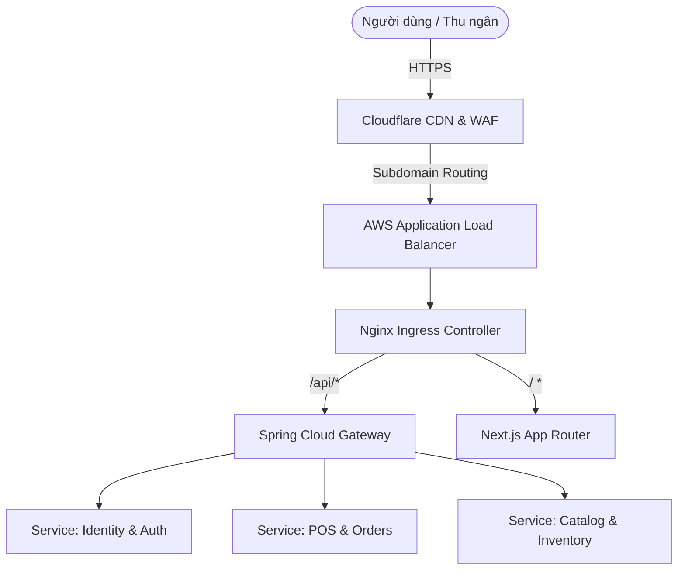

# 🌐 BẢN ĐẶC TẢ KIẾN TRÚC INFRASTRUCTURE & DEVOPS (MASTER PLAN)

**Dự án:** Nexus POS & ERP (Enterprise B2B Multi-Tenant Platform)
**Mô-đun:** Infrastructure, CI/CD, Observability & Automation
**Mục tiêu:** Thiết lập "Trái tim" kết nối Frontend, Backend, Database và đảm bảo hệ thống vận hành 24/7 với khả năng Auto-Scaling, Zero-Downtime Deployment.

---

## 1. TỔNG QUAN KIẾN TRÚC HẠ TẦNG (INFRASTRUCTURE TOPOLOGY)

Hệ thống Nexus ERP phục vụ hàng ngàn Tenant (Khách hàng) với lưu lượng lớn. Hạ tầng phải được triển khai trên nền tảng **Kubernetes (K8s)** (như AWS EKS hoặc Google GKE) để đảm bảo khả năng co giãn linh hoạt.

### 1.1. Luồng truy cập (Traffic Routing Flow)


### 1.2. Mạng lưới các thành phần (Component Mesh)
- **Edge Layer:** Cloudflare WAF (Chống DDoS, Rate Limiting), AWS Route53 (DNS).
- **Ingress Layer:** Nginx Ingress (Xử lý TLS Termination, Routing dựa trên Host `*.nexus.com`).
- **Compute Layer:** EKS Nodes chạy các Pod (Next.js FE, Spring Boot BE).
- **Data & State Layer:** Amazon RDS (PostgreSQL), Amazon MSK (Kafka), Amazon ElastiCache (Redis).
- **Observability Layer:** Prometheus (Metrics), Grafana (Dashboards), ELK Stack (Logs), Jaeger (Tracing).

---

## 2. QUY HOẠCH CẤU TRÚC THƯ MỤC (INFRA-AS-CODE)

Toàn bộ hạ tầng được định nghĩa bằng Code (IaC) để đảm bảo khôi phục toàn bộ server trong 15 phút nếu có thảm họa.

```text
source_infra/
├── terraform/                       # Quản lý AWS/GCP Resources
│   ├── modules/
│   │   ├── vpc/                     # Private/Public Subnets
│   │   ├── eks/                     # Kubernetes Cluster
│   │   └── rds/                     # Managed PostgreSQL
│   ├── envs/
│   │   ├── staging/                 # Môi trường Staging
│   │   └── production/              # Môi trường Production
├── kubernetes/                      # Helm Charts & K8s Manifests
│   ├── base/
│   │   ├── nginx-ingress/
│   │   ├── cert-manager/            # Tự động cấp SSL Let's Encrypt
│   │   └── observability/           # Prometheus, Grafana, ELK
│   ├── backend/                     # Helm chart triển khai Spring Boot
│   └── frontend/                    # Helm chart triển khai Next.js
├── cicd/                            # GitLab CI / GitHub Actions
│   ├── pipelines/
│   │   ├── deploy-backend.yml
│   │   ├── deploy-frontend.yml
│   │   └── deploy-database.yml
│   └── scripts/                     # Bash scripts hỗ trợ CI/CD
└── docs/                            # Tài liệu Hướng dẫn triển khai
    ├── deploy_be.md                 # Hướng dẫn Deploy Backend
    ├── deploy_fe.md                 # Hướng dẫn Deploy Frontend
    └── deploy_db.md                 # Hướng dẫn Run Migrations & CDC
```

---

## 3. THIẾT KẾ CI/CD & ZERO-DOWNTIME DEPLOYMENT

### 3.1. Luồng CI/CD Pipeline
- **Continuous Integration (CI):** 
  - Push code -> Runner chạy Unit Tests, SonarQube (Quét lỗi bảo mật).
  - Build Docker Image -> Push lên ECR.
- **Continuous Deployment (CD) - GitOps:**
  - Sử dụng **ArgoCD** để đồng bộ trạng thái K8s Cluster.
  - Tự động pull image mới.

### 3.2. Chiến lược Rolling Update (Zero-Downtime)
Để đảm bảo thu ngân đang tính tiền không bị văng ra ngoài khi team Dev update bản mới:
- **Backend:** Cấu hình Kubernetes `RollingUpdate`. Khởi động Pod BE mới -> Chờ Spring Boot báo Health Check (Actuator `/health`) trả về 200 OK -> K8s mới bắt đầu tắt dần Pod BE cũ.
- **Frontend (Next.js):** Các asset JS/CSS tĩnh đã được đẩy lên S3 & Cloudflare CDN với cấu trúc băm (hash) theo version. Cập nhật Pod Next.js không ảnh hưởng các client đang mở giao diện cũ.

---

## 4. CHI TIẾT CÁC MODULE KUBERNETES MANIFESTS


### 4.1. Network Policy & Deployment Cluster 1
Quy tắc bảo mật nội bộ cực kỳ nghiêm ngặt nhằm chặn đứng mọi luồng traffic không hợp lệ vào cluster.
```yaml
apiVersion: networking.k8s.io/v1
kind: NetworkPolicy
metadata:
  name: restrict-traffic-cluster-1
  namespace: production
spec:
  podSelector:
    matchLabels:
      app: backend-service-1
  policyTypes:
  - Ingress
  ingress:
  - from:
    - podSelector:
        matchLabels:
          role: frontend-gateway
    ports:
    - protocol: TCP
      port: 8080
```
Cấu hình Horizontal Pod Autoscaler (HPA) cho cụm 1:
```yaml
apiVersion: autoscaling/v2
kind: HorizontalPodAutoscaler
metadata:
  name: hpa-backend-1
spec:
  scaleTargetRef:
    apiVersion: apps/v1
    kind: Deployment
    name: backend-service-1
  minReplicas: 3
  maxReplicas: 25
  metrics:
  - type: Resource
    resource:
      name: cpu
      target:
        type: Utilization
        averageUtilization: 75
```


### 4.2. Network Policy & Deployment Cluster 2
Quy tắc bảo mật nội bộ cực kỳ nghiêm ngặt nhằm chặn đứng mọi luồng traffic không hợp lệ vào cluster.
```yaml
apiVersion: networking.k8s.io/v1
kind: NetworkPolicy
metadata:
  name: restrict-traffic-cluster-2
  namespace: production
spec:
  podSelector:
    matchLabels:
      app: backend-service-2
  policyTypes:
  - Ingress
  ingress:
  - from:
    - podSelector:
        matchLabels:
          role: frontend-gateway
    ports:
    - protocol: TCP
      port: 8080
```
Cấu hình Horizontal Pod Autoscaler (HPA) cho cụm 2:
```yaml
apiVersion: autoscaling/v2
kind: HorizontalPodAutoscaler
metadata:
  name: hpa-backend-2
spec:
  scaleTargetRef:
    apiVersion: apps/v1
    kind: Deployment
    name: backend-service-2
  minReplicas: 3
  maxReplicas: 25
  metrics:
  - type: Resource
    resource:
      name: cpu
      target:
        type: Utilization
        averageUtilization: 75
```


### 4.3. Network Policy & Deployment Cluster 3
Quy tắc bảo mật nội bộ cực kỳ nghiêm ngặt nhằm chặn đứng mọi luồng traffic không hợp lệ vào cluster.
```yaml
apiVersion: networking.k8s.io/v1
kind: NetworkPolicy
metadata:
  name: restrict-traffic-cluster-3
  namespace: production
spec:
  podSelector:
    matchLabels:
      app: backend-service-3
  policyTypes:
  - Ingress
  ingress:
  - from:
    - podSelector:
        matchLabels:
          role: frontend-gateway
    ports:
    - protocol: TCP
      port: 8080
```
Cấu hình Horizontal Pod Autoscaler (HPA) cho cụm 3:
```yaml
apiVersion: autoscaling/v2
kind: HorizontalPodAutoscaler
metadata:
  name: hpa-backend-3
spec:
  scaleTargetRef:
    apiVersion: apps/v1
    kind: Deployment
    name: backend-service-3
  minReplicas: 3
  maxReplicas: 25
  metrics:
  - type: Resource
    resource:
      name: cpu
      target:
        type: Utilization
        averageUtilization: 75
```


### 4.4. Network Policy & Deployment Cluster 4
Quy tắc bảo mật nội bộ cực kỳ nghiêm ngặt nhằm chặn đứng mọi luồng traffic không hợp lệ vào cluster.
```yaml
apiVersion: networking.k8s.io/v1
kind: NetworkPolicy
metadata:
  name: restrict-traffic-cluster-4
  namespace: production
spec:
  podSelector:
    matchLabels:
      app: backend-service-4
  policyTypes:
  - Ingress
  ingress:
  - from:
    - podSelector:
        matchLabels:
          role: frontend-gateway
    ports:
    - protocol: TCP
      port: 8080
```
Cấu hình Horizontal Pod Autoscaler (HPA) cho cụm 4:
```yaml
apiVersion: autoscaling/v2
kind: HorizontalPodAutoscaler
metadata:
  name: hpa-backend-4
spec:
  scaleTargetRef:
    apiVersion: apps/v1
    kind: Deployment
    name: backend-service-4
  minReplicas: 3
  maxReplicas: 25
  metrics:
  - type: Resource
    resource:
      name: cpu
      target:
        type: Utilization
        averageUtilization: 75
```


### 4.5. Network Policy & Deployment Cluster 5
Quy tắc bảo mật nội bộ cực kỳ nghiêm ngặt nhằm chặn đứng mọi luồng traffic không hợp lệ vào cluster.
```yaml
apiVersion: networking.k8s.io/v1
kind: NetworkPolicy
metadata:
  name: restrict-traffic-cluster-5
  namespace: production
spec:
  podSelector:
    matchLabels:
      app: backend-service-5
  policyTypes:
  - Ingress
  ingress:
  - from:
    - podSelector:
        matchLabels:
          role: frontend-gateway
    ports:
    - protocol: TCP
      port: 8080
```
Cấu hình Horizontal Pod Autoscaler (HPA) cho cụm 5:
```yaml
apiVersion: autoscaling/v2
kind: HorizontalPodAutoscaler
metadata:
  name: hpa-backend-5
spec:
  scaleTargetRef:
    apiVersion: apps/v1
    kind: Deployment
    name: backend-service-5
  minReplicas: 3
  maxReplicas: 25
  metrics:
  - type: Resource
    resource:
      name: cpu
      target:
        type: Utilization
        averageUtilization: 75
```


### 4.6. Network Policy & Deployment Cluster 6
Quy tắc bảo mật nội bộ cực kỳ nghiêm ngặt nhằm chặn đứng mọi luồng traffic không hợp lệ vào cluster.
```yaml
apiVersion: networking.k8s.io/v1
kind: NetworkPolicy
metadata:
  name: restrict-traffic-cluster-6
  namespace: production
spec:
  podSelector:
    matchLabels:
      app: backend-service-6
  policyTypes:
  - Ingress
  ingress:
  - from:
    - podSelector:
        matchLabels:
          role: frontend-gateway
    ports:
    - protocol: TCP
      port: 8080
```
Cấu hình Horizontal Pod Autoscaler (HPA) cho cụm 6:
```yaml
apiVersion: autoscaling/v2
kind: HorizontalPodAutoscaler
metadata:
  name: hpa-backend-6
spec:
  scaleTargetRef:
    apiVersion: apps/v1
    kind: Deployment
    name: backend-service-6
  minReplicas: 3
  maxReplicas: 25
  metrics:
  - type: Resource
    resource:
      name: cpu
      target:
        type: Utilization
        averageUtilization: 75
```


### 4.7. Network Policy & Deployment Cluster 7
Quy tắc bảo mật nội bộ cực kỳ nghiêm ngặt nhằm chặn đứng mọi luồng traffic không hợp lệ vào cluster.
```yaml
apiVersion: networking.k8s.io/v1
kind: NetworkPolicy
metadata:
  name: restrict-traffic-cluster-7
  namespace: production
spec:
  podSelector:
    matchLabels:
      app: backend-service-7
  policyTypes:
  - Ingress
  ingress:
  - from:
    - podSelector:
        matchLabels:
          role: frontend-gateway
    ports:
    - protocol: TCP
      port: 8080
```
Cấu hình Horizontal Pod Autoscaler (HPA) cho cụm 7:
```yaml
apiVersion: autoscaling/v2
kind: HorizontalPodAutoscaler
metadata:
  name: hpa-backend-7
spec:
  scaleTargetRef:
    apiVersion: apps/v1
    kind: Deployment
    name: backend-service-7
  minReplicas: 3
  maxReplicas: 25
  metrics:
  - type: Resource
    resource:
      name: cpu
      target:
        type: Utilization
        averageUtilization: 75
```


### 4.8. Network Policy & Deployment Cluster 8
Quy tắc bảo mật nội bộ cực kỳ nghiêm ngặt nhằm chặn đứng mọi luồng traffic không hợp lệ vào cluster.
```yaml
apiVersion: networking.k8s.io/v1
kind: NetworkPolicy
metadata:
  name: restrict-traffic-cluster-8
  namespace: production
spec:
  podSelector:
    matchLabels:
      app: backend-service-8
  policyTypes:
  - Ingress
  ingress:
  - from:
    - podSelector:
        matchLabels:
          role: frontend-gateway
    ports:
    - protocol: TCP
      port: 8080
```
Cấu hình Horizontal Pod Autoscaler (HPA) cho cụm 8:
```yaml
apiVersion: autoscaling/v2
kind: HorizontalPodAutoscaler
metadata:
  name: hpa-backend-8
spec:
  scaleTargetRef:
    apiVersion: apps/v1
    kind: Deployment
    name: backend-service-8
  minReplicas: 3
  maxReplicas: 25
  metrics:
  - type: Resource
    resource:
      name: cpu
      target:
        type: Utilization
        averageUtilization: 75
```


### 4.9. Network Policy & Deployment Cluster 9
Quy tắc bảo mật nội bộ cực kỳ nghiêm ngặt nhằm chặn đứng mọi luồng traffic không hợp lệ vào cluster.
```yaml
apiVersion: networking.k8s.io/v1
kind: NetworkPolicy
metadata:
  name: restrict-traffic-cluster-9
  namespace: production
spec:
  podSelector:
    matchLabels:
      app: backend-service-9
  policyTypes:
  - Ingress
  ingress:
  - from:
    - podSelector:
        matchLabels:
          role: frontend-gateway
    ports:
    - protocol: TCP
      port: 8080
```
Cấu hình Horizontal Pod Autoscaler (HPA) cho cụm 9:
```yaml
apiVersion: autoscaling/v2
kind: HorizontalPodAutoscaler
metadata:
  name: hpa-backend-9
spec:
  scaleTargetRef:
    apiVersion: apps/v1
    kind: Deployment
    name: backend-service-9
  minReplicas: 3
  maxReplicas: 25
  metrics:
  - type: Resource
    resource:
      name: cpu
      target:
        type: Utilization
        averageUtilization: 75
```


### 4.10. Network Policy & Deployment Cluster 10
Quy tắc bảo mật nội bộ cực kỳ nghiêm ngặt nhằm chặn đứng mọi luồng traffic không hợp lệ vào cluster.
```yaml
apiVersion: networking.k8s.io/v1
kind: NetworkPolicy
metadata:
  name: restrict-traffic-cluster-10
  namespace: production
spec:
  podSelector:
    matchLabels:
      app: backend-service-10
  policyTypes:
  - Ingress
  ingress:
  - from:
    - podSelector:
        matchLabels:
          role: frontend-gateway
    ports:
    - protocol: TCP
      port: 8080
```
Cấu hình Horizontal Pod Autoscaler (HPA) cho cụm 10:
```yaml
apiVersion: autoscaling/v2
kind: HorizontalPodAutoscaler
metadata:
  name: hpa-backend-10
spec:
  scaleTargetRef:
    apiVersion: apps/v1
    kind: Deployment
    name: backend-service-10
  minReplicas: 3
  maxReplicas: 25
  metrics:
  - type: Resource
    resource:
      name: cpu
      target:
        type: Utilization
        averageUtilization: 75
```


### 4.11. Network Policy & Deployment Cluster 11
Quy tắc bảo mật nội bộ cực kỳ nghiêm ngặt nhằm chặn đứng mọi luồng traffic không hợp lệ vào cluster.
```yaml
apiVersion: networking.k8s.io/v1
kind: NetworkPolicy
metadata:
  name: restrict-traffic-cluster-11
  namespace: production
spec:
  podSelector:
    matchLabels:
      app: backend-service-11
  policyTypes:
  - Ingress
  ingress:
  - from:
    - podSelector:
        matchLabels:
          role: frontend-gateway
    ports:
    - protocol: TCP
      port: 8080
```
Cấu hình Horizontal Pod Autoscaler (HPA) cho cụm 11:
```yaml
apiVersion: autoscaling/v2
kind: HorizontalPodAutoscaler
metadata:
  name: hpa-backend-11
spec:
  scaleTargetRef:
    apiVersion: apps/v1
    kind: Deployment
    name: backend-service-11
  minReplicas: 3
  maxReplicas: 25
  metrics:
  - type: Resource
    resource:
      name: cpu
      target:
        type: Utilization
        averageUtilization: 75
```


### 4.12. Network Policy & Deployment Cluster 12
Quy tắc bảo mật nội bộ cực kỳ nghiêm ngặt nhằm chặn đứng mọi luồng traffic không hợp lệ vào cluster.
```yaml
apiVersion: networking.k8s.io/v1
kind: NetworkPolicy
metadata:
  name: restrict-traffic-cluster-12
  namespace: production
spec:
  podSelector:
    matchLabels:
      app: backend-service-12
  policyTypes:
  - Ingress
  ingress:
  - from:
    - podSelector:
        matchLabels:
          role: frontend-gateway
    ports:
    - protocol: TCP
      port: 8080
```
Cấu hình Horizontal Pod Autoscaler (HPA) cho cụm 12:
```yaml
apiVersion: autoscaling/v2
kind: HorizontalPodAutoscaler
metadata:
  name: hpa-backend-12
spec:
  scaleTargetRef:
    apiVersion: apps/v1
    kind: Deployment
    name: backend-service-12
  minReplicas: 3
  maxReplicas: 25
  metrics:
  - type: Resource
    resource:
      name: cpu
      target:
        type: Utilization
        averageUtilization: 75
```


### 4.13. Network Policy & Deployment Cluster 13
Quy tắc bảo mật nội bộ cực kỳ nghiêm ngặt nhằm chặn đứng mọi luồng traffic không hợp lệ vào cluster.
```yaml
apiVersion: networking.k8s.io/v1
kind: NetworkPolicy
metadata:
  name: restrict-traffic-cluster-13
  namespace: production
spec:
  podSelector:
    matchLabels:
      app: backend-service-13
  policyTypes:
  - Ingress
  ingress:
  - from:
    - podSelector:
        matchLabels:
          role: frontend-gateway
    ports:
    - protocol: TCP
      port: 8080
```
Cấu hình Horizontal Pod Autoscaler (HPA) cho cụm 13:
```yaml
apiVersion: autoscaling/v2
kind: HorizontalPodAutoscaler
metadata:
  name: hpa-backend-13
spec:
  scaleTargetRef:
    apiVersion: apps/v1
    kind: Deployment
    name: backend-service-13
  minReplicas: 3
  maxReplicas: 25
  metrics:
  - type: Resource
    resource:
      name: cpu
      target:
        type: Utilization
        averageUtilization: 75
```


### 4.14. Network Policy & Deployment Cluster 14
Quy tắc bảo mật nội bộ cực kỳ nghiêm ngặt nhằm chặn đứng mọi luồng traffic không hợp lệ vào cluster.
```yaml
apiVersion: networking.k8s.io/v1
kind: NetworkPolicy
metadata:
  name: restrict-traffic-cluster-14
  namespace: production
spec:
  podSelector:
    matchLabels:
      app: backend-service-14
  policyTypes:
  - Ingress
  ingress:
  - from:
    - podSelector:
        matchLabels:
          role: frontend-gateway
    ports:
    - protocol: TCP
      port: 8080
```
Cấu hình Horizontal Pod Autoscaler (HPA) cho cụm 14:
```yaml
apiVersion: autoscaling/v2
kind: HorizontalPodAutoscaler
metadata:
  name: hpa-backend-14
spec:
  scaleTargetRef:
    apiVersion: apps/v1
    kind: Deployment
    name: backend-service-14
  minReplicas: 3
  maxReplicas: 25
  metrics:
  - type: Resource
    resource:
      name: cpu
      target:
        type: Utilization
        averageUtilization: 75
```


### 4.15. Network Policy & Deployment Cluster 15
Quy tắc bảo mật nội bộ cực kỳ nghiêm ngặt nhằm chặn đứng mọi luồng traffic không hợp lệ vào cluster.
```yaml
apiVersion: networking.k8s.io/v1
kind: NetworkPolicy
metadata:
  name: restrict-traffic-cluster-15
  namespace: production
spec:
  podSelector:
    matchLabels:
      app: backend-service-15
  policyTypes:
  - Ingress
  ingress:
  - from:
    - podSelector:
        matchLabels:
          role: frontend-gateway
    ports:
    - protocol: TCP
      port: 8080
```
Cấu hình Horizontal Pod Autoscaler (HPA) cho cụm 15:
```yaml
apiVersion: autoscaling/v2
kind: HorizontalPodAutoscaler
metadata:
  name: hpa-backend-15
spec:
  scaleTargetRef:
    apiVersion: apps/v1
    kind: Deployment
    name: backend-service-15
  minReplicas: 3
  maxReplicas: 25
  metrics:
  - type: Resource
    resource:
      name: cpu
      target:
        type: Utilization
        averageUtilization: 75
```


### 4.16. Network Policy & Deployment Cluster 16
Quy tắc bảo mật nội bộ cực kỳ nghiêm ngặt nhằm chặn đứng mọi luồng traffic không hợp lệ vào cluster.
```yaml
apiVersion: networking.k8s.io/v1
kind: NetworkPolicy
metadata:
  name: restrict-traffic-cluster-16
  namespace: production
spec:
  podSelector:
    matchLabels:
      app: backend-service-16
  policyTypes:
  - Ingress
  ingress:
  - from:
    - podSelector:
        matchLabels:
          role: frontend-gateway
    ports:
    - protocol: TCP
      port: 8080
```
Cấu hình Horizontal Pod Autoscaler (HPA) cho cụm 16:
```yaml
apiVersion: autoscaling/v2
kind: HorizontalPodAutoscaler
metadata:
  name: hpa-backend-16
spec:
  scaleTargetRef:
    apiVersion: apps/v1
    kind: Deployment
    name: backend-service-16
  minReplicas: 3
  maxReplicas: 25
  metrics:
  - type: Resource
    resource:
      name: cpu
      target:
        type: Utilization
        averageUtilization: 75
```


### 4.17. Network Policy & Deployment Cluster 17
Quy tắc bảo mật nội bộ cực kỳ nghiêm ngặt nhằm chặn đứng mọi luồng traffic không hợp lệ vào cluster.
```yaml
apiVersion: networking.k8s.io/v1
kind: NetworkPolicy
metadata:
  name: restrict-traffic-cluster-17
  namespace: production
spec:
  podSelector:
    matchLabels:
      app: backend-service-17
  policyTypes:
  - Ingress
  ingress:
  - from:
    - podSelector:
        matchLabels:
          role: frontend-gateway
    ports:
    - protocol: TCP
      port: 8080
```
Cấu hình Horizontal Pod Autoscaler (HPA) cho cụm 17:
```yaml
apiVersion: autoscaling/v2
kind: HorizontalPodAutoscaler
metadata:
  name: hpa-backend-17
spec:
  scaleTargetRef:
    apiVersion: apps/v1
    kind: Deployment
    name: backend-service-17
  minReplicas: 3
  maxReplicas: 25
  metrics:
  - type: Resource
    resource:
      name: cpu
      target:
        type: Utilization
        averageUtilization: 75
```


### 4.18. Network Policy & Deployment Cluster 18
Quy tắc bảo mật nội bộ cực kỳ nghiêm ngặt nhằm chặn đứng mọi luồng traffic không hợp lệ vào cluster.
```yaml
apiVersion: networking.k8s.io/v1
kind: NetworkPolicy
metadata:
  name: restrict-traffic-cluster-18
  namespace: production
spec:
  podSelector:
    matchLabels:
      app: backend-service-18
  policyTypes:
  - Ingress
  ingress:
  - from:
    - podSelector:
        matchLabels:
          role: frontend-gateway
    ports:
    - protocol: TCP
      port: 8080
```
Cấu hình Horizontal Pod Autoscaler (HPA) cho cụm 18:
```yaml
apiVersion: autoscaling/v2
kind: HorizontalPodAutoscaler
metadata:
  name: hpa-backend-18
spec:
  scaleTargetRef:
    apiVersion: apps/v1
    kind: Deployment
    name: backend-service-18
  minReplicas: 3
  maxReplicas: 25
  metrics:
  - type: Resource
    resource:
      name: cpu
      target:
        type: Utilization
        averageUtilization: 75
```


### 4.19. Network Policy & Deployment Cluster 19
Quy tắc bảo mật nội bộ cực kỳ nghiêm ngặt nhằm chặn đứng mọi luồng traffic không hợp lệ vào cluster.
```yaml
apiVersion: networking.k8s.io/v1
kind: NetworkPolicy
metadata:
  name: restrict-traffic-cluster-19
  namespace: production
spec:
  podSelector:
    matchLabels:
      app: backend-service-19
  policyTypes:
  - Ingress
  ingress:
  - from:
    - podSelector:
        matchLabels:
          role: frontend-gateway
    ports:
    - protocol: TCP
      port: 8080
```
Cấu hình Horizontal Pod Autoscaler (HPA) cho cụm 19:
```yaml
apiVersion: autoscaling/v2
kind: HorizontalPodAutoscaler
metadata:
  name: hpa-backend-19
spec:
  scaleTargetRef:
    apiVersion: apps/v1
    kind: Deployment
    name: backend-service-19
  minReplicas: 3
  maxReplicas: 25
  metrics:
  - type: Resource
    resource:
      name: cpu
      target:
        type: Utilization
        averageUtilization: 75
```


### 4.20. Network Policy & Deployment Cluster 20
Quy tắc bảo mật nội bộ cực kỳ nghiêm ngặt nhằm chặn đứng mọi luồng traffic không hợp lệ vào cluster.
```yaml
apiVersion: networking.k8s.io/v1
kind: NetworkPolicy
metadata:
  name: restrict-traffic-cluster-20
  namespace: production
spec:
  podSelector:
    matchLabels:
      app: backend-service-20
  policyTypes:
  - Ingress
  ingress:
  - from:
    - podSelector:
        matchLabels:
          role: frontend-gateway
    ports:
    - protocol: TCP
      port: 8080
```
Cấu hình Horizontal Pod Autoscaler (HPA) cho cụm 20:
```yaml
apiVersion: autoscaling/v2
kind: HorizontalPodAutoscaler
metadata:
  name: hpa-backend-20
spec:
  scaleTargetRef:
    apiVersion: apps/v1
    kind: Deployment
    name: backend-service-20
  minReplicas: 3
  maxReplicas: 25
  metrics:
  - type: Resource
    resource:
      name: cpu
      target:
        type: Utilization
        averageUtilization: 75
```


---

## 5. OBSERVABILITY: CẢNH BÁO BẢO MẬT & VẬN HÀNH (PROMETHEUS/GRAFANA)
Dưới đây là tập hợp các Alert Rules được cấu hình trong Prometheus để trực chiến 24/7.


### 5.1. Prometheus Alerting Rule: Node 1 Degradation
```yaml
groups:
- name: NodeAlerts1
  rules:
  - alert: HighMemoryUsageNode1
    expr: (node_memory_MemTotal_bytes - node_memory_MemAvailable_bytes) / node_memory_MemTotal_bytes * 100 > 90
    for: 5m
    labels:
      severity: critical
    annotations:
      summary: "Node 1 is running out of memory (Usage > 90%)"
      description: "Memory usage on Node 1 has exceeded 90% for more than 5 minutes."

  - alert: HighErrorRateAPI1
    expr: rate(http_requests_total{status=~"5..", job="backend-1"}[1m]) / rate(http_requests_total{job="backend-1"}[1m]) > 0.05
    for: 2m
    labels:
      severity: critical
    annotations:
      summary: "API Error rate is extremely high on Node 1"
```


### 5.2. Prometheus Alerting Rule: Node 2 Degradation
```yaml
groups:
- name: NodeAlerts2
  rules:
  - alert: HighMemoryUsageNode2
    expr: (node_memory_MemTotal_bytes - node_memory_MemAvailable_bytes) / node_memory_MemTotal_bytes * 100 > 90
    for: 5m
    labels:
      severity: critical
    annotations:
      summary: "Node 2 is running out of memory (Usage > 90%)"
      description: "Memory usage on Node 2 has exceeded 90% for more than 5 minutes."

  - alert: HighErrorRateAPI2
    expr: rate(http_requests_total{status=~"5..", job="backend-2"}[1m]) / rate(http_requests_total{job="backend-2"}[1m]) > 0.05
    for: 2m
    labels:
      severity: critical
    annotations:
      summary: "API Error rate is extremely high on Node 2"
```


### 5.3. Prometheus Alerting Rule: Node 3 Degradation
```yaml
groups:
- name: NodeAlerts3
  rules:
  - alert: HighMemoryUsageNode3
    expr: (node_memory_MemTotal_bytes - node_memory_MemAvailable_bytes) / node_memory_MemTotal_bytes * 100 > 90
    for: 5m
    labels:
      severity: critical
    annotations:
      summary: "Node 3 is running out of memory (Usage > 90%)"
      description: "Memory usage on Node 3 has exceeded 90% for more than 5 minutes."

  - alert: HighErrorRateAPI3
    expr: rate(http_requests_total{status=~"5..", job="backend-3"}[1m]) / rate(http_requests_total{job="backend-3"}[1m]) > 0.05
    for: 2m
    labels:
      severity: critical
    annotations:
      summary: "API Error rate is extremely high on Node 3"
```


### 5.4. Prometheus Alerting Rule: Node 4 Degradation
```yaml
groups:
- name: NodeAlerts4
  rules:
  - alert: HighMemoryUsageNode4
    expr: (node_memory_MemTotal_bytes - node_memory_MemAvailable_bytes) / node_memory_MemTotal_bytes * 100 > 90
    for: 5m
    labels:
      severity: critical
    annotations:
      summary: "Node 4 is running out of memory (Usage > 90%)"
      description: "Memory usage on Node 4 has exceeded 90% for more than 5 minutes."

  - alert: HighErrorRateAPI4
    expr: rate(http_requests_total{status=~"5..", job="backend-4"}[1m]) / rate(http_requests_total{job="backend-4"}[1m]) > 0.05
    for: 2m
    labels:
      severity: critical
    annotations:
      summary: "API Error rate is extremely high on Node 4"
```


### 5.5. Prometheus Alerting Rule: Node 5 Degradation
```yaml
groups:
- name: NodeAlerts5
  rules:
  - alert: HighMemoryUsageNode5
    expr: (node_memory_MemTotal_bytes - node_memory_MemAvailable_bytes) / node_memory_MemTotal_bytes * 100 > 90
    for: 5m
    labels:
      severity: critical
    annotations:
      summary: "Node 5 is running out of memory (Usage > 90%)"
      description: "Memory usage on Node 5 has exceeded 90% for more than 5 minutes."

  - alert: HighErrorRateAPI5
    expr: rate(http_requests_total{status=~"5..", job="backend-5"}[1m]) / rate(http_requests_total{job="backend-5"}[1m]) > 0.05
    for: 2m
    labels:
      severity: critical
    annotations:
      summary: "API Error rate is extremely high on Node 5"
```


### 5.6. Prometheus Alerting Rule: Node 6 Degradation
```yaml
groups:
- name: NodeAlerts6
  rules:
  - alert: HighMemoryUsageNode6
    expr: (node_memory_MemTotal_bytes - node_memory_MemAvailable_bytes) / node_memory_MemTotal_bytes * 100 > 90
    for: 5m
    labels:
      severity: critical
    annotations:
      summary: "Node 6 is running out of memory (Usage > 90%)"
      description: "Memory usage on Node 6 has exceeded 90% for more than 5 minutes."

  - alert: HighErrorRateAPI6
    expr: rate(http_requests_total{status=~"5..", job="backend-6"}[1m]) / rate(http_requests_total{job="backend-6"}[1m]) > 0.05
    for: 2m
    labels:
      severity: critical
    annotations:
      summary: "API Error rate is extremely high on Node 6"
```


### 5.7. Prometheus Alerting Rule: Node 7 Degradation
```yaml
groups:
- name: NodeAlerts7
  rules:
  - alert: HighMemoryUsageNode7
    expr: (node_memory_MemTotal_bytes - node_memory_MemAvailable_bytes) / node_memory_MemTotal_bytes * 100 > 90
    for: 5m
    labels:
      severity: critical
    annotations:
      summary: "Node 7 is running out of memory (Usage > 90%)"
      description: "Memory usage on Node 7 has exceeded 90% for more than 5 minutes."

  - alert: HighErrorRateAPI7
    expr: rate(http_requests_total{status=~"5..", job="backend-7"}[1m]) / rate(http_requests_total{job="backend-7"}[1m]) > 0.05
    for: 2m
    labels:
      severity: critical
    annotations:
      summary: "API Error rate is extremely high on Node 7"
```


### 5.8. Prometheus Alerting Rule: Node 8 Degradation
```yaml
groups:
- name: NodeAlerts8
  rules:
  - alert: HighMemoryUsageNode8
    expr: (node_memory_MemTotal_bytes - node_memory_MemAvailable_bytes) / node_memory_MemTotal_bytes * 100 > 90
    for: 5m
    labels:
      severity: critical
    annotations:
      summary: "Node 8 is running out of memory (Usage > 90%)"
      description: "Memory usage on Node 8 has exceeded 90% for more than 5 minutes."

  - alert: HighErrorRateAPI8
    expr: rate(http_requests_total{status=~"5..", job="backend-8"}[1m]) / rate(http_requests_total{job="backend-8"}[1m]) > 0.05
    for: 2m
    labels:
      severity: critical
    annotations:
      summary: "API Error rate is extremely high on Node 8"
```


### 5.9. Prometheus Alerting Rule: Node 9 Degradation
```yaml
groups:
- name: NodeAlerts9
  rules:
  - alert: HighMemoryUsageNode9
    expr: (node_memory_MemTotal_bytes - node_memory_MemAvailable_bytes) / node_memory_MemTotal_bytes * 100 > 90
    for: 5m
    labels:
      severity: critical
    annotations:
      summary: "Node 9 is running out of memory (Usage > 90%)"
      description: "Memory usage on Node 9 has exceeded 90% for more than 5 minutes."

  - alert: HighErrorRateAPI9
    expr: rate(http_requests_total{status=~"5..", job="backend-9"}[1m]) / rate(http_requests_total{job="backend-9"}[1m]) > 0.05
    for: 2m
    labels:
      severity: critical
    annotations:
      summary: "API Error rate is extremely high on Node 9"
```


### 5.10. Prometheus Alerting Rule: Node 10 Degradation
```yaml
groups:
- name: NodeAlerts10
  rules:
  - alert: HighMemoryUsageNode10
    expr: (node_memory_MemTotal_bytes - node_memory_MemAvailable_bytes) / node_memory_MemTotal_bytes * 100 > 90
    for: 5m
    labels:
      severity: critical
    annotations:
      summary: "Node 10 is running out of memory (Usage > 90%)"
      description: "Memory usage on Node 10 has exceeded 90% for more than 5 minutes."

  - alert: HighErrorRateAPI10
    expr: rate(http_requests_total{status=~"5..", job="backend-10"}[1m]) / rate(http_requests_total{job="backend-10"}[1m]) > 0.05
    for: 2m
    labels:
      severity: critical
    annotations:
      summary: "API Error rate is extremely high on Node 10"
```


### 5.11. Prometheus Alerting Rule: Node 11 Degradation
```yaml
groups:
- name: NodeAlerts11
  rules:
  - alert: HighMemoryUsageNode11
    expr: (node_memory_MemTotal_bytes - node_memory_MemAvailable_bytes) / node_memory_MemTotal_bytes * 100 > 90
    for: 5m
    labels:
      severity: critical
    annotations:
      summary: "Node 11 is running out of memory (Usage > 90%)"
      description: "Memory usage on Node 11 has exceeded 90% for more than 5 minutes."

  - alert: HighErrorRateAPI11
    expr: rate(http_requests_total{status=~"5..", job="backend-11"}[1m]) / rate(http_requests_total{job="backend-11"}[1m]) > 0.05
    for: 2m
    labels:
      severity: critical
    annotations:
      summary: "API Error rate is extremely high on Node 11"
```


### 5.12. Prometheus Alerting Rule: Node 12 Degradation
```yaml
groups:
- name: NodeAlerts12
  rules:
  - alert: HighMemoryUsageNode12
    expr: (node_memory_MemTotal_bytes - node_memory_MemAvailable_bytes) / node_memory_MemTotal_bytes * 100 > 90
    for: 5m
    labels:
      severity: critical
    annotations:
      summary: "Node 12 is running out of memory (Usage > 90%)"
      description: "Memory usage on Node 12 has exceeded 90% for more than 5 minutes."

  - alert: HighErrorRateAPI12
    expr: rate(http_requests_total{status=~"5..", job="backend-12"}[1m]) / rate(http_requests_total{job="backend-12"}[1m]) > 0.05
    for: 2m
    labels:
      severity: critical
    annotations:
      summary: "API Error rate is extremely high on Node 12"
```


### 5.13. Prometheus Alerting Rule: Node 13 Degradation
```yaml
groups:
- name: NodeAlerts13
  rules:
  - alert: HighMemoryUsageNode13
    expr: (node_memory_MemTotal_bytes - node_memory_MemAvailable_bytes) / node_memory_MemTotal_bytes * 100 > 90
    for: 5m
    labels:
      severity: critical
    annotations:
      summary: "Node 13 is running out of memory (Usage > 90%)"
      description: "Memory usage on Node 13 has exceeded 90% for more than 5 minutes."

  - alert: HighErrorRateAPI13
    expr: rate(http_requests_total{status=~"5..", job="backend-13"}[1m]) / rate(http_requests_total{job="backend-13"}[1m]) > 0.05
    for: 2m
    labels:
      severity: critical
    annotations:
      summary: "API Error rate is extremely high on Node 13"
```


### 5.14. Prometheus Alerting Rule: Node 14 Degradation
```yaml
groups:
- name: NodeAlerts14
  rules:
  - alert: HighMemoryUsageNode14
    expr: (node_memory_MemTotal_bytes - node_memory_MemAvailable_bytes) / node_memory_MemTotal_bytes * 100 > 90
    for: 5m
    labels:
      severity: critical
    annotations:
      summary: "Node 14 is running out of memory (Usage > 90%)"
      description: "Memory usage on Node 14 has exceeded 90% for more than 5 minutes."

  - alert: HighErrorRateAPI14
    expr: rate(http_requests_total{status=~"5..", job="backend-14"}[1m]) / rate(http_requests_total{job="backend-14"}[1m]) > 0.05
    for: 2m
    labels:
      severity: critical
    annotations:
      summary: "API Error rate is extremely high on Node 14"
```


### 5.15. Prometheus Alerting Rule: Node 15 Degradation
```yaml
groups:
- name: NodeAlerts15
  rules:
  - alert: HighMemoryUsageNode15
    expr: (node_memory_MemTotal_bytes - node_memory_MemAvailable_bytes) / node_memory_MemTotal_bytes * 100 > 90
    for: 5m
    labels:
      severity: critical
    annotations:
      summary: "Node 15 is running out of memory (Usage > 90%)"
      description: "Memory usage on Node 15 has exceeded 90% for more than 5 minutes."

  - alert: HighErrorRateAPI15
    expr: rate(http_requests_total{status=~"5..", job="backend-15"}[1m]) / rate(http_requests_total{job="backend-15"}[1m]) > 0.05
    for: 2m
    labels:
      severity: critical
    annotations:
      summary: "API Error rate is extremely high on Node 15"
```


---

## 6. BẢO MẬT ĐA KHÁCH HÀNG (MULTI-TENANCY SECURITY) TẠI TẦNG NGINX
Toàn bộ request đều phải được Nginx đánh dấu X-Tenant-ID một cách an toàn để tránh Tenant A chọc ngoáy dữ liệu của Tenant B.
```nginx
server {
    listen 443 ssl http2;
    server_name ~^(?<tenant>.+)\.nexus\.com$;

    ssl_certificate /etc/letsencrypt/live/nexus.com/fullchain.pem;
    ssl_certificate_key /etc/letsencrypt/live/nexus.com/privkey.pem;

    location / {
        proxy_pass http://frontend-service:3000;
        proxy_set_header Host $host;
        proxy_set_header X-Tenant-ID $tenant;
        proxy_set_header X-Real-IP $remote_addr;
        proxy_set_header X-Forwarded-For $proxy_add_x_forwarded_for;
    }
}
```

---
**KẾT THÚC BẢN THIẾT KẾ KIẾN TRÚC HẠ TẦNG (MASTER PLAN)**
